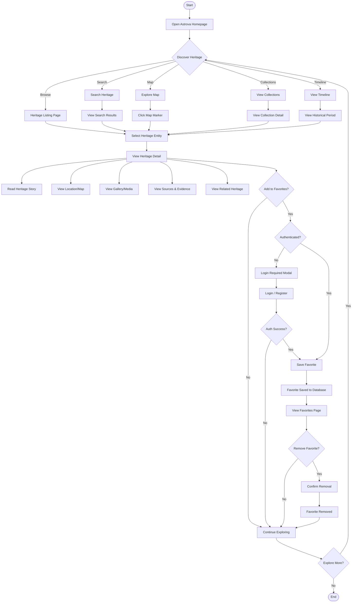
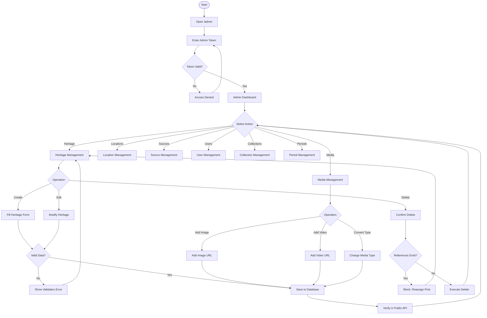
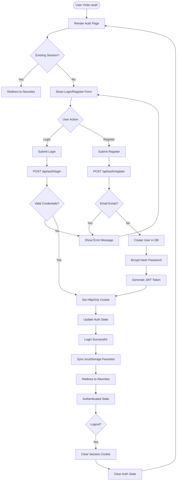

# Activity Diagram — Astrova

## Primary User Journey

```mermaid
flowchart TD
    Start([Start]) --> OpenAstrova[Open Astrova Homepage]
    
    OpenAstrova --> DiscoverOptions{Discover Heritage}
    
    DiscoverOptions -->|Browse| HeritageListing[Heritage Listing Page]
    DiscoverOptions -->|Search| SearchPage[Search Heritage]
    DiscoverOptions -->|Map| ExploreMap[Explore Map]
    DiscoverOptions -->|Collections| CollectionsPage[View Collections]
    DiscoverOptions -->|Timeline| TimelinePage[View Timeline]
    
    HeritageListing --> SelectHeritage[Select Heritage Entity]
    SearchPage --> SearchResults[View Search Results]
    ExploreMap --> MapMarker[Click Map Marker]
    CollectionsPage --> CollectionDetail[View Collection Detail]
    TimelinePage --> PeriodDetail[View Historical Period]
    
    SearchResults --> SelectHeritage
    MapMarker --> SelectHeritage
    CollectionDetail --> SelectHeritage
    PeriodDetail --> SelectHeritage
    
    SelectHeritage --> HeritageDetail[View Heritage Detail]
    
    HeritageDetail --> ViewStory[Read Heritage Story]
    HeritageDetail --> ViewLocation[View Location/Map]
    HeritageDetail --> ViewMedia[View Gallery/Media]
    HeritageDetail --> ViewSources[View Sources & Evidence]
    HeritageDetail --> ViewRelated[View Related Heritage]
    
    HeritageDetail --> FavoriteAction{Add to Favorites?}
    
    FavoriteAction -->|No| ContinueExploring[Continue Exploring]
    FavoriteAction -->|Yes| AuthCheck{Authenticated?}
    
    AuthCheck -->|No| LoginRequired[Login Required Modal]
    LoginRequired --> LoginPage[Login / Register]
    LoginPage --> AuthSuccess{Auth Success?}
    AuthSuccess -->|Yes| SaveFavorite[Save Favorite]
    AuthSuccess -->|No| ContinueExploring
    
    AuthCheck -->|Yes| SaveFavorite
    
    SaveFavorite --> FavoriteSaved[Favorite Saved to Database]
    FavoriteSaved --> ViewFavorites[View Favorites Page]
    ViewFavorites --> RemoveFavorite{Remove Favorite?}
    RemoveFavorite -->|No| ContinueExploring
    RemoveFavorite -->|Yes| ConfirmRemove[Confirm Removal]
    ConfirmRemove --> FavoriteRemoved[Favorite Removed]
    FavoriteRemoved --> ContinueExploring
    
    ContinueExploring --> MoreExploring{Explore More?}
    MoreExploring -->|Yes| DiscoverOptions
    MoreExploring -->|No| End([End])
```

## Admin Content Management Journey

```mermaid
flowchart TD
    Start([Start]) --> AdminLogin[Open /admin]
    
    AdminLogin --> EnterToken[Enter Admin Token]
    EnterToken --> TokenCheck{Token Valid?}
    
    TokenCheck -->|No| AccessDenied[Access Denied]
    AccessDenied --> EnterToken
    
    TokenCheck -->|Yes| Dashboard[Admin Dashboard]
    
    Dashboard --> AdminAction{Select Action}
    
    AdminAction -->|Heritage| HeritageMgmt[Heritage Management]
    AdminAction -->|Media| MediaMgmt[Media Management]
    AdminAction -->|Locations| LocationMgmt[Location Management]
    AdminAction -->|Sources| SourceMgmt[Source Management]
    AdminAction -->|Users| UserMgmt[User Management]
    AdminAction -->|Collections| CollectionMgmt[Collection Management]
    AdminAction -->|Periods| PeriodMgmt[Period Management]
    
    HeritageMgmt --> HeritageOp{Operation}
    HeritageOp -->|Create| CreateHeritage[Fill Heritage Form]
    HeritageOp -->|Edit| EditHeritage[Modify Heritage]
    HeritageOp -->|Delete| DeleteHeritage[Confirm Delete]
    
    CreateHeritage --> ValidateData{Valid Data?}
    EditHeritage --> ValidateData
    
    ValidateData -->|No| ShowError[Show Validation Error]
    ShowError --> HeritageMgmt
    
    ValidateData -->|Yes| SaveDB[Save to Database]
    SaveDB --> VerifyPublic[Verify in Public API]
    VerifyPublic --> AdminAction
    
    DeleteHeritage --> CheckRefs{References Exist?}
    CheckRefs -->|Yes| BlockDelete[Block: Reassign First]
    BlockDelete --> HeritageMgmt
    CheckRefs -->|No| ExecuteDelete[Execute Delete]
    ExecuteDelete --> AdminAction
    
    MediaMgmt --> MediaOp{Operation}
    MediaOp -->|Add Image| AddImage[Add Image URL]
    MediaOp -->|Add Video| AddVideo[Add Video URL]
    MediaOp -->|Convert Type| ConvertType[Change Media Type]
    
    AddImage --> SaveDB
    AddVideo --> SaveDB
    ConvertType --> SaveDB
```

## Authentication Flow

```mermaid
flowchart TD
    Start([User Visits /auth]) --> AuthPage[Render Auth Page]
    
    AuthPage --> CheckSession{Existing Session?}
    CheckSession -->|Yes| RedirectFav[Redirect to /favorites]
    CheckSession -->|No| ShowForm[Show Login/Register Form]
    
    ShowForm --> UserAction{User Action}
    
    UserAction -->|Login| LoginSubmit[Submit Login]
    UserAction -->|Register| RegisterSubmit[Submit Register]
    
    LoginSubmit --> BackendLogin[POST /api/auth/login]
    BackendLogin --> ValidateCreds{Valid Credentials?}
    
    ValidateCreds -->|No| ShowError[Show Error Message]
    ShowError --> ShowForm
    
    ValidateCreds -->|Yes| SetCookie[Set HttpOnly Cookie]
    SetCookie --> UpdateState[Update Auth State]
    UpdateState --> LoginSuccess[Login Successful]
    
    RegisterSubmit --> BackendRegister[POST /api/auth/register]
    BackendRegister --> CheckDuplicate{Email Exists?}
    
    CheckDuplicate -->|Yes| ShowError
    CheckDuplicate -->|No| CreateUser[Create User in DB]
    CreateUser --> HashPassword[Bcrypt Hash Password]
    HashPassword --> GenerateJWT[Generate JWT Token]
    GenerateJWT --> SetCookie
    
    LoginSuccess --> SyncFavorites[Sync localStorage Favorites]
    SyncFavorites --> Redirect[Redirect to /favorites]
    Redirect --> Authenticated[Authenticated State]
    
    Authenticated --> Logout{Logout?}
    Logout -->|Yes| ClearCookie[Clear Session Cookie]
    ClearCookie --> ClearState[Clear Auth State]
    ClearState --> AuthPage
```
