# Class Diagram — Astrova

## Mermaid Class Diagram

```mermaid
classDiagram
    %% ===== FRONTEND LAYER =====
    class AuthProvider {
        +user: User | null
        +loading: boolean
        +login(email, password)
        +register(name, email, password)
        +logout()
        +refresh()
    }
    
    class User {
        +id: string
        +name: string
        +email: string
    }
    
    class useFavorites {
        +favorites: string[]
        +loaded: boolean
        +authenticated: boolean
        +syncing: boolean
        +isFavorited(heritageId): boolean
        +toggleFavorite(heritageId)
        +addFavorite(heritageId)
        +removeFavorite(heritageId)
        +syncToBackend()
        +refreshFavorites()
    }
    
    class useApi~T~ {
        +data: T
        +loading: boolean
        +error: string
        +refetch()
    }
    
    class FavoriteButton {
        +heritageId: string
        +isFavorited: boolean
        +onToggle(heritageId)
        +showLoginPrompt: boolean
    }
    
    class SearchModal {
        +query: string
        +results: SearchResult[]
        +loading: boolean
        +open: boolean
    }
    
    class AstrovaMap {
        +locations: Location[]
        +heritage: HeritageEntity[]
        +selectedState: string
        +filters: MapFilters
    }
    
    %% ===== BACKEND LAYER =====
    class ExpressApp {
        +use(middleware)
        +use(router)
        +listen(port)
    }
    
    class AuthMiddleware {
        +requireAuth(req, res, next)
        +optionalAuth(req, res, next)
        +generateToken(user): string
        +setAuthCookie(res, token)
        +clearAuthCookie(res)
        +isAuthConfigured(): boolean
    }
    
    class AdminMiddleware {
        +requireAdmin(req, res, next)
    }
    
    class ApiKeyMiddleware {
        +requireDevelopmentApiKey(req, res, next)
    }
    
    class RateLimitMiddleware {
        +rateLimit(config)
        +authRateLimit
        +loginRateLimit
        +registerRateLimit
        +chatRateLimit
        +favoritesRateLimit
    }
    
    class HeritageRoutes {
        +list(req, res)
        +getById(req, res)
        +getStateCounts(req, res)
    }
    
    class FavoritesRoutes {
        +list(req, res)
        +getStatus(req, res)
        +add(req, res)
        +remove(req, res)
        +sync(req, res)
    }
    
    class AdminRoutes {
        +overview(req, res)
        +heritage CRUD(req, res)
        +media CRUD(req, res)
        +locations CRUD(req, res)
        +sources CRUD(req, res)
        +users(req, res)
        +collections CRUD(req, res)
        +periods CRUD(req, res)
        +analytics(req, res)
    }
    
    class AuthRoutes {
        +register(req, res)
        +login(req, res)
        +logout(req, res)
        +me(req, res)
    }
    
    class SearchRoutes {
        +search(req, res)
        +suggestions(req, res)
    }
    
    class ChatbotService {
        +detectScriptLanguage(text): string
        +detectIntent(message, language): string
        +retrieveKnowledge(intent, language, state): Knowledge[]
        +generateResponse(intent, knowledge, language): string
    }
    
    class DatabaseLayer {
        +query(sql, params): QueryResult
    }
    
    %% ===== DATA MODELS =====
    class HeritageEntity {
        +id: UUID
        +name: string
        +slug: string
        +category: string
        +description: string
        +location_id: UUID
        +period_id: UUID
        +source_id: UUID
    }
    
    class Location {
        +id: UUID
        +name: string
        +slug: string
        +type: string
        +latitude: decimal
        +longitude: decimal
        +state: string
    }
    
    class HistoricalPeriod {
        +id: UUID
        +name: string
        +start_year: integer
        +end_year: integer
        +description: string
    }
    
    class Media {
        +id: UUID
        +entity_id: UUID
        +type: string
        +url: string
        +caption: string
        +is_primary: boolean
    }
    
    class Source {
        +id: UUID
        +title: string
        +author: string
        +source_type: string
        +verification_status: string
    }
    
    class UserAccount {
        +id: UUID
        +name: string
        +email: string
        +password_hash: string
    }
    
    class UserFavorite {
        +id: UUID
        +user_id: UUID
        +heritage_entity_id: UUID
    }
    
    class Collection {
        +id: UUID
        +name: string
        +slug: string
        +description: string
        +is_active: boolean
    }
    
    %% ===== RELATIONSHIPS =====
    AuthProvider --> User : manages
    useFavorites --> AuthProvider : uses auth state
    FavoriteButton --> useFavorites : uses
    SearchModal --> useApi : uses
    AstrovaMap --> useApi : uses
    
    ExpressApp --> AuthMiddleware : uses
    ExpressApp --> AdminMiddleware : uses
    ExpressApp --> ApiKeyMiddleware : uses
    ExpressApp --> RateLimitMiddleware : uses
    ExpressApp --> HeritageRoutes : mounts
    ExpressApp --> FavoritesRoutes : mounts
    ExpressApp --> AdminRoutes : mounts
    ExpressApp --> AuthRoutes : mounts
    ExpressApp --> SearchRoutes : mounts
    
    HeritageRoutes --> DatabaseLayer : queries
    FavoritesRoutes --> DatabaseLayer : queries
    AdminRoutes --> DatabaseLayer : queries
    AuthRoutes --> DatabaseLayer : queries
    SearchRoutes --> DatabaseLayer : queries
    ChatbotService --> DatabaseLayer : queries
    
    AuthMiddleware --> UserAccount : verifies
    FavoritesRoutes --> UserFavorite : manages
    AdminRoutes --> HeritageEntity : manages
    AdminRoutes --> Media : manages
    AdminRoutes --> Location : manages
    AdminRoutes --> Source : manages
    AdminRoutes --> Collection : manages
    
    HeritageEntity --> Location : "location_id FK"
    HeritageEntity --> HistoricalPeriod : "period_id FK"
    HeritageEntity --> Source : "source_id FK"
    Media --> HeritageEntity : "entity_id FK"
    UserFavorite --> UserAccount : "user_id FK"
    UserFavorite --> HeritageEntity : "heritage_entity_id FK"
```

## Module Descriptions

### Frontend Modules

| Module | Type | Purpose |
|--------|------|---------|
| `AuthProvider` | Context Provider | Manages global authentication state, login/logout/register |
| `useFavorites` | React Hook | Manages favorites state with backend sync |
| `useApi<T>` | React Hook | Generic API data fetching with loading/error states |
| `FavoriteButton` | Component | Heart toggle with login-required modal |
| `SearchModal` | Component | Global search with suggestions |
| `AstrovaMap` | Component | Leaflet map with heritage markers |

### Backend Modules

| Module | Type | Purpose |
|--------|------|---------|
| `ExpressApp` | Application | Main Express server with middleware and routes |
| `AuthMiddleware` | Middleware | JWT verification, cookie handling |
| `AdminMiddleware` | Middleware | X-Admin-Token verification |
| `ApiKeyMiddleware` | Middleware | X-API-Key validation |
| `RateLimitMiddleware` | Middleware | Request rate limiting |
| `HeritageRoutes` | Route Handler | Heritage CRUD and queries |
| `FavoritesRoutes` | Route Handler | User favorites management |
| `AdminRoutes` | Route Handler | Admin content management |
| `AuthRoutes` | Route Handler | User authentication |
| `SearchRoutes` | Route Handler | Full-text search |
| `ChatbotService` | Service | Multilingual chatbot logic |
| `DatabaseLayer` | Data Access | PostgreSQL query execution |

### Data Models

| Model | Table | Purpose |
|-------|-------|---------|
| `HeritageEntity` | heritage_entities | Cultural heritage records |
| `Location` | locations | Geographic locations |
| `HistoricalPeriod` | historical_periods | Time periods |
| `Media` | media | Images/videos/documents |
| `Source` | sources | Reference sources |
| `UserAccount` | users | User accounts |
| `UserFavorite` | user_favorites | Per-user favorites |
| `Collection` | collections | Curated collections |
