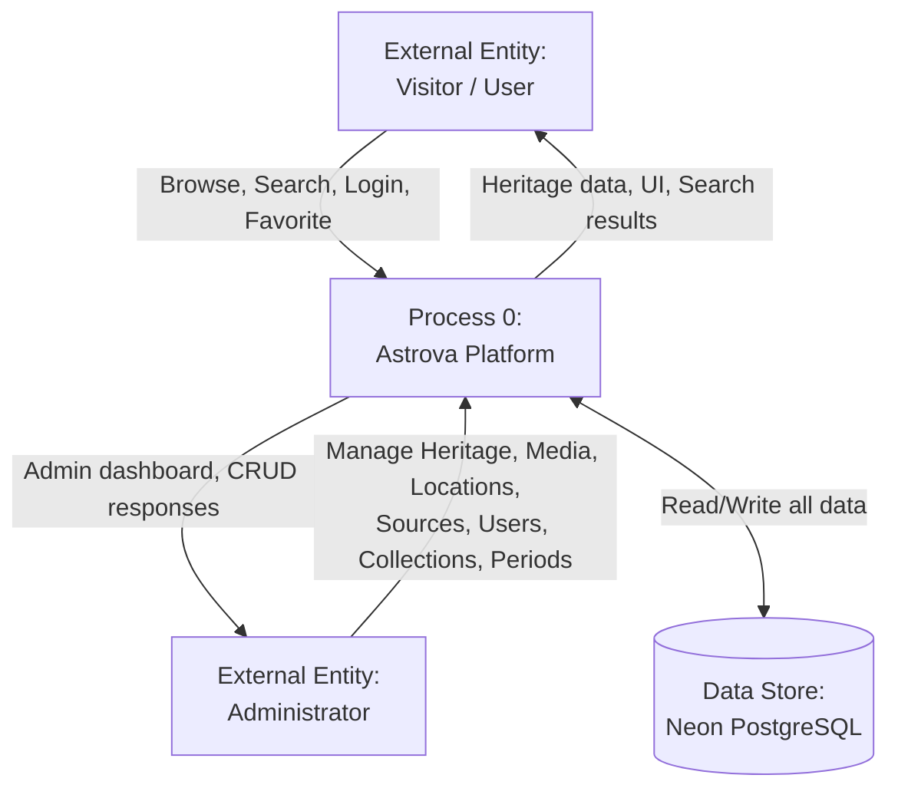
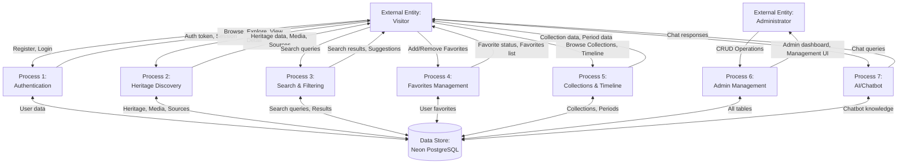
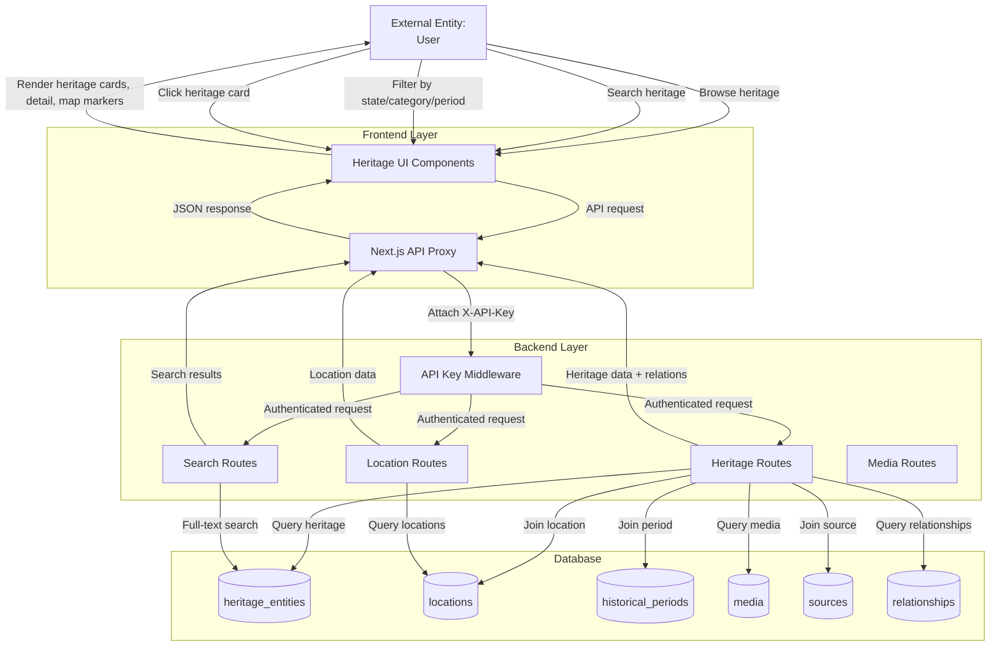
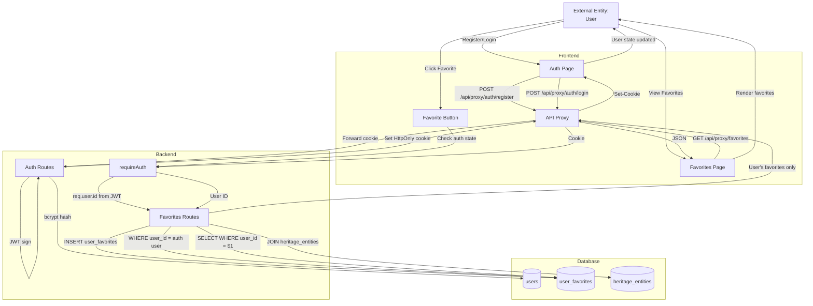

# Data Flow Diagrams — Astrova

## DFD Level 0 — Context Diagram

**Explanation**: The context diagram shows Astrova as a single process interacting with two external entities (Visitors and Administrators) and one data store (Neon PostgreSQL). Visitors browse heritage, search, authenticate, and manage favorites. Administrators manage all content through the Admin Portal.

---

## DFD Level 1 — Major Processes

**Explanation**: Level 1 breaks Astrova into 7 major processes. Each process interacts with the database and serves specific user needs.

---

## DFD Level 2 — Heritage Discovery (Detailed)

**Explanation**: Level 2 shows the detailed data flow for heritage discovery. The user interacts with the frontend, which proxies requests through the Next.js API layer. The backend validates the API key, queries the database with appropriate JOINs, and returns structured JSON data that the frontend renders.

---

## DFD Level 2 — Authentication & Favorites (Detailed)

**Explanation**: Level 2 for Authentication & Favorites shows the complete flow from registration through favorite management. Key security points: (1) Passwords are hashed with bcrypt, (2) JWT is stored in HttpOnly cookie, (3) Favorites are always scoped to the authenticated user via `requireAuth` middleware, (4) The backend derives user identity from JWT, never from client-supplied data.
