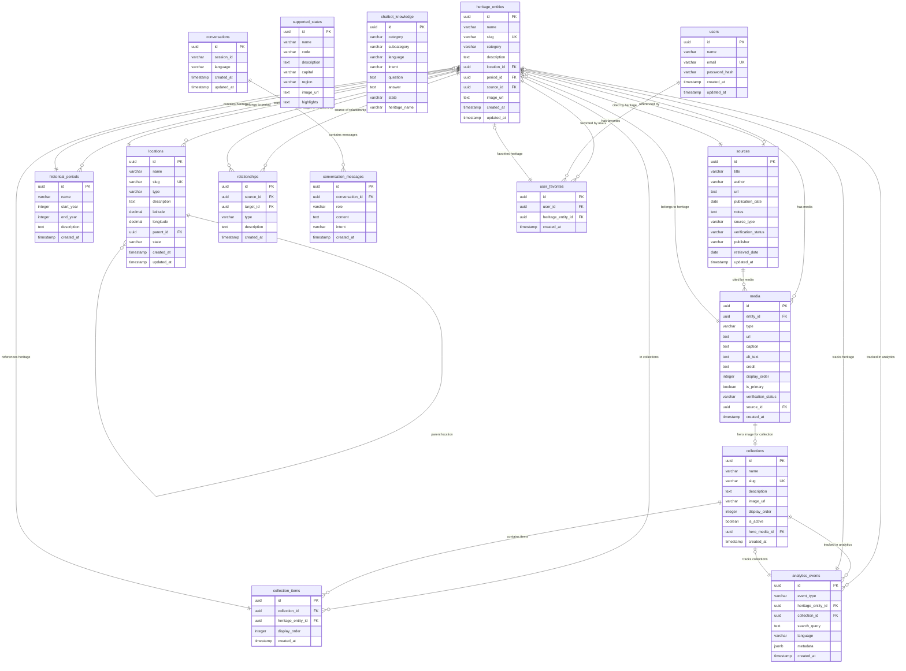

# Entity Relationship Diagram — Astrova

## Mermaid ER Diagram

## Human-Readable Explanation

### Core Entities

1. **heritage_entities** (74 records) — The central table. Each record represents an Indian cultural heritage entity (monument, craft, tradition, festival, etc.) with name, slug, category, description, and links to location, period, and source.

2. **locations** (54 records) — Geographic locations where heritage exists. Supports hierarchical structure (state → district → city → site) via self-referencing `parent_id`. Contains latitude/longitude coordinates for map display.

3. **historical_periods** (9 records) — Time periods from Ancient Period (-3300 BCE) to Modern Period (1947–present). Each heritage entity can be linked to one period.

4. **media** (72 records) — Images, videos, documents associated with heritage entities. Supports primary media flag for hero display. All current records are images.

5. **sources** (18 records) — Academic, government, and other reference sources cited by heritage entities. Includes verification status.

### Relationship Tables

6. **relationships** (49 records) — Many-to-many relationships between heritage entities (e.g., "LOCATED_IN", "ASSOCIATED_WITH", "BUILT_BY").

7. **collections** (7 records) — Curated groupings of heritage entities (e.g., "Sacred Architecture", "Indian Crafts").

8. **collection_items** (98 records) — Junction table linking collections to heritage entities.

### User & Auth

9. **users** (25 records) — User accounts with name, email, bcrypt-hashed password.

10. **user_favorites** (4 records) — Per-user favorite heritage entities. Enforces unique (user_id, heritage_entity_id) constraint.

### Chatbot

11. **chatbot_knowledge** (107 records) — Multilingual Q&A knowledge base for the chatbot.

12. **conversations** — Chat session tracking.

13. **conversation_messages** — Individual chat messages.

### Analytics

14. **analytics_events** (0 records) — Usage tracking for heritage views, searches, collection views.

### Reference

15. **supported_states** (12 records) — Indian states with metadata, highlights, and images for the homepage state discovery section.

### Key Relationships

- **Heritage → Location**: Many-to-one (heritage can have one location; location can have many heritage)
- **Heritage → Period**: Many-to-one
- **Heritage → Source**: Many-to-one (optional)
- **Heritage → Media**: One-to-many
- **Heritage ↔ Heritage**: Many-to-many (via relationships table)
- **Collection ↔ Heritage**: Many-to-many (via collection_items)
- **User → Favorites → Heritage**: Many-to-many (via user_favorites)
