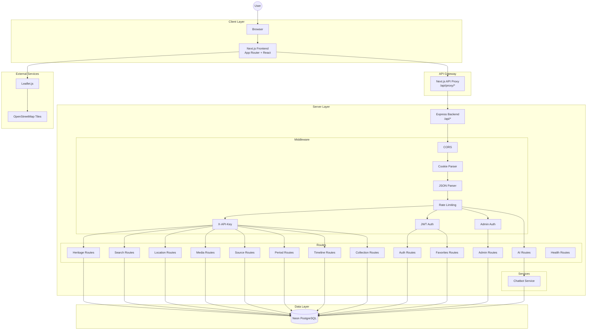
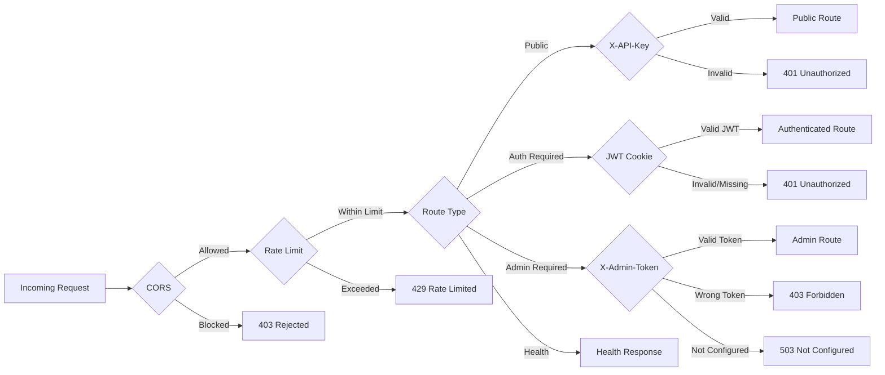

# System Architecture — Astrova

## Mermaid Architecture Diagram

## Layer Responsibilities

### Client Layer
| Component | Technology | Responsibility |
|-----------|-----------|----------------|
| Browser | Chrome/Firefox/Safari | Render HTML, execute JS, handle user input |
| Next.js Frontend | Next.js 16 + React 19 | Server-side rendering, client-side navigation, state management |

### API Gateway
| Component | Technology | Responsibility |
|-----------|-----------|----------------|
| API Proxy | Next.js Route Handler | Attach X-API-Key server-side (never exposed to browser), forward cookies/admin tokens, route to Express |

### Server Layer
| Component | Technology | Responsibility |
|-----------|-----------|----------------|
| Express Backend | Express 4 | HTTP server, request routing, business logic |
| Middleware | Various | Security, authentication, rate limiting, parsing |
| Routes | Express Router | Endpoint handlers for each domain |
| Services | TypeScript | Business logic (chatbot) |

### Data Layer
| Component | Technology | Responsibility |
|-----------|-----------|----------------|
| Neon PostgreSQL | Serverless PostgreSQL | Persistent data storage for all entities |

### External Services
| Service | Technology | Responsibility | Status |
|---------|-----------|----------------|--------|
| Map Tiles | OpenStreetMap | Map tile rendering | Active |
| Map Rendering | Leaflet.js | Interactive map with markers | Active |
| AI Chatbot | Custom service | Multilingual chatbot | Under Construction |

## Security Architecture

## Key Design Decisions

1. **API Key Server-Side Only**: The `DEMO_API_KEY` is never exposed to the browser. The Next.js proxy attaches it server-side.

2. **JWT in HttpOnly Cookie**: Authentication tokens are stored in HttpOnly cookies, preventing XSS access. `SameSite: lax` prevents CSRF for most cases.

3. **Backend-Derived User Identity**: All authenticated operations (favorites, etc.) derive user ID from the JWT token, never from client-supplied data.

4. **In-Memory Rate Limiting**: Rate limits are stored in server memory (resets on restart). Acceptable for single-server deployment.

5. **URL-Based Media**: Heritage media (images/videos) are stored as URLs in the database, not as binary files. No cloud storage integration.

6. **Serverless Database**: Neon PostgreSQL provides serverless PostgreSQL with automatic scaling.
