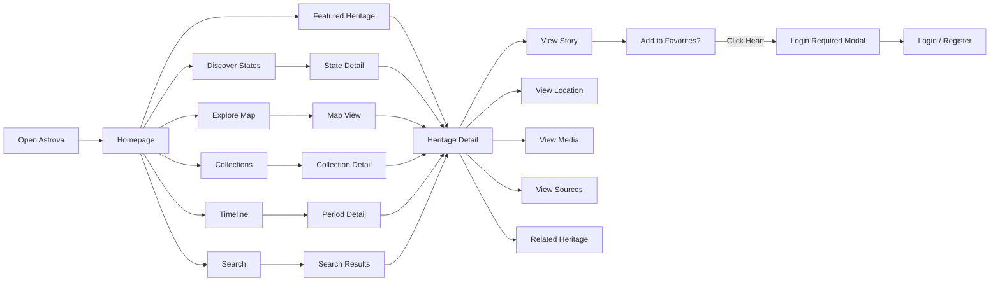
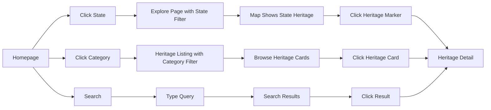
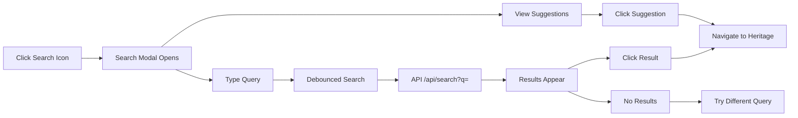
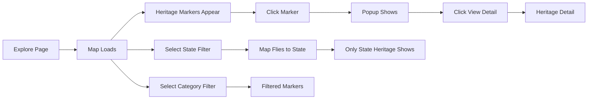
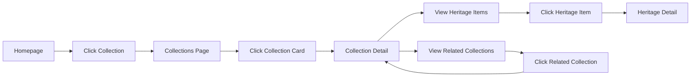
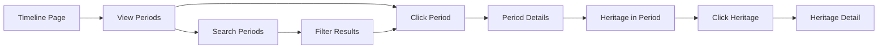
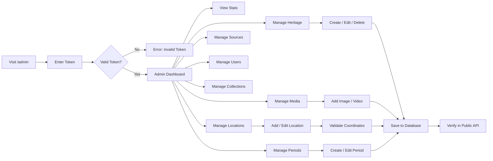

# User Flow — Astrova

## 1. Visitor Journey (Unauthenticated)



**Description**: Visitors can freely browse all public content — heritage listings, map, timeline, collections, search. When they try to favorite, they're prompted to authenticate.

## 2. Registration Journey

```mermaid
flowchart LR
    A[Click Create Account] --> B[/auth Page]
    B --> C[Enter Name]
    C --> D[Enter Email]
    D --> E[Enter Password]
    E --> F[Click Create Account]
    F --> G{Validation Pass?}
    G -->|No| H[Show Error]
    H --> B
    G -->|Yes| I[POST /api/auth/register]
    I --> J{Email Exists?}
    J -->|Yes| K[Show Duplicate Error]
    K --> B
    J -->|No| L[Hash Password]
    L --> M[Create User]
    M --> N[Generate JWT]
    N --> O[Set HttpOnly Cookie]
    O --> P[Sync localStorage]
    P --> Q[Redirect to /favorites]
```

## 3. Login Journey

```mermaid
flowchart LR
    A[Click Sign In] --> B[/auth Page]
    B --> C[Enter Email]
    C --> D[Enter Password]
    D --> E[Click Sign In]
    E --> F{Validation Pass?}
    F -->|No| G[Show Error]
    G --> B
    F -->|Yes| H[POST /api/auth/login]
    H --> I{Valid Credentials?}
    I -->|No| J[Show Invalid Credentials]
    J --> B
    I -->|Yes| K[Generate JWT]
    K --> L[Set HttpOnly Cookie]
    L --> M[Update Auth State]
    M --> N[Sync localStorage Favorites]
    N --> O[Redirect to /favorites]
```

## 4. Favorite Journey

```mermaid
flowchart LR
    A[Heritage Detail Page] --> B[Click Heart Icon]
    B --> C{Authenticated?}
    C -->|No| D[Login Required Modal]
    D --> E[Click Sign In]
    E --> F[/auth Page]
    F --> G[Login]
    G --> H[Return to Heritage]
    H --> B
    
    C -->|Yes| I[toggleFavorite]
    I --> J[Optimistic UI Update]
    J --> K[POST /api/favorites/:id]
    K --> L{Backend Success?}
    L -->|No| M[Revert UI]
    L -->|Yes| N[Heart Filled]
    
    N --> O[Visit /favorites]
    O --> P[See Favorite in List]
    P --> Q[Click Remove?]
    Q -->|Yes| R[DELETE /api/favorites/:id]
    R --> S[Heart Unfilled]
```

## 5. Heritage Discovery Journey



## 6. Search Journey



## 7. Map Journey



## 8. Collection Journey



## 9. Timeline Journey



## 10. Admin Journey


