# Astrova — Complete System Architecture & Technical Analysis

**Team Meeting Documentation**
**Current Implementation Checkpoint: P1.29**
**Date: September 1, 2026**

---

## Table of Contents

1. [Executive Summary](#1-executive-summary)
2. [Project Objectives](#2-project-objectives)
3. [System Overview](#3-system-overview)
4. [System Architecture](#4-system-architecture)
5. [Technology Stack](#5-technology-stack)
6. [Project Folder Structure](#6-project-folder-structure)
7. [Database Architecture](#7-database-architecture)
8. [E-R Diagram](#8-e-r-diagram)
9. [Data Dictionary](#9-data-dictionary)
10. [Backend Architecture](#10-backend-architecture)
11. [API Documentation](#11-api-documentation)
12. [API Flow Diagram](#12-api-flow-diagram)
13. [Data Flow Diagrams](#13-data-flow-diagrams)
14. [Use-Case Diagram](#14-use-case-diagram)
15. [Class/Component Diagram](#15-classcomponent-diagram)
16. [Activity Diagram](#16-activity-diagram)
17. [Chatbot Activity Flow](#17-chatbot-activity-flow)
18. [Sequence Diagrams](#18-sequence-diagrams)
19. [Heritage Discovery Flow](#19-heritage-discovery-flow)
20. [Search Architecture](#20-search-architecture)
21. [Map Architecture](#21-map-architecture)
22. [Timeline Architecture](#22-timeline-architecture)
23. [Collection Architecture](#23-collection-architecture)
24. [Favorites Architecture](#24-favorites-architecture)
25. [Analytics Architecture](#25-analytics-architecture)
26. [Admin Architecture](#26-admin-architecture)
27. [Multilingual Architecture](#27-multilingual-architecture)
28. [Security Architecture](#28-security-architecture)
29. [External API Inventory](#29-external-api-inventory)
30. [Performance Architecture](#30-performance-architecture)
31. [Accessibility / UX](#31-accessibility--ux)
32. [Implementation History](#32-implementation-history)
33. [Current System Status](#33-current-system-status)
34. [Current Database Metrics](#34-current-database-metrics)
35. [Known Issues](#35-known-issues)
36. [Future Roadmap](#36-future-roadmap)
37. [Team Role Breakdown](#37-team-role-breakdown)
38. [Team Meeting Talking Points](#38-team-meeting-talking-points)
39. [Final System Summary](#39-final-system-summary)

---

## 1. Executive Summary

Astrova is an **interactive Indian Heritage Discovery Platform** that enables users to explore, discover, and learn about India's cultural heritage across 12 states and 74 heritage entities. The platform combines an interactive map, a multilingual AI chatbot supporting 6 Indian languages, curated heritage collections, historical timeline navigation, and a search system with relevance ranking.

### Problem Solved

India's vast cultural heritage lacks a unified, interactive digital discovery platform that covers monuments, crafts, traditions, festivals, food, and natural landmarks across multiple states with multilingual support.

### Target Users

- Heritage enthusiasts and cultural explorers
- Students and researchers
- Tourists planning visits to Indian heritage sites
- Anyone interested in Indian culture, history, and traditions

### Core Functionality

| Capability | Description |
|---|---|
| Heritage Discovery | Browse, search, and filter 74 heritage entities |
| Interactive Map | Explore heritage locations with state/period/category filtering |
| Multilingual Chatbot | Ask questions in 6 Indian languages with AI-powered responses |
| Collections | 6 curated thematic collections with 98 entity associations |
| Timeline | Navigate 9 historical periods with entity grids |
| Search | Full-text search with relevance ranking and autocomplete |
| Gallery | Multi-image gallery with lightbox viewer |
| Favorites | Save heritage to personal favorites (localStorage) |
| Admin Dashboard | Content management and analytics overview |

### Current Maturity

The platform has completed **11 implementation phases** (P1.19 through P1.29), evolving from a basic map and heritage listing into a comprehensive discovery platform with chatbot AI, collections, analytics infrastructure, and admin controls.

---

## 2. Project Objectives

### Primary Objectives

- Provide a comprehensive, searchable database of Indian heritage entities across 12 states
- Enable interactive map-based heritage discovery
- Support multilingual heritage exploration (English, Gujarati, Hindi, Marathi, Tamil, Punjabi)
- Create curated heritage collections for thematic discovery

### Secondary Objectives

- Build an AI-powered chatbot for natural-language heritage queries
- Provide historical timeline navigation
- Enable heritage relationship exploration
- Support editorial content management

### Discovery Objectives

- Make heritage discoverable through multiple paths (search, map, timeline, collections, chatbot)
- Ensure all discovery paths are interconnected
- Support both browsing and targeted search behaviors

### Cultural / Heritage Objectives

- Preserve and present cultural information accurately
- Never fabricate historical facts, dates, or cultural claims
- Handle all cultural content conservatively and respectfully

### Future Scalability Objectives

- User authentication and persistent data
- Advanced analytics and insights
- Media management for editorial teams
- Offline/PWA support

---

## 3. System Overview

### High-Level Data Flow

```
┌─────────────┐     ┌──────────────────┐     ┌──────────────────┐     ┌────────────────┐
│             │     │  Next.js Frontend │     │  Express Backend  │     │  Neon          │
│    User     │────▶│  Port 3000        │────▶│  Port 3001        │────▶│  PostgreSQL    │
│   Browser   │◀────│  App Router       │◀────│  REST API         │◀────│                │
│             │     │  React + Tailwind  │     │  TypeScript       │     │                │
└─────────────┘     └──────────────────┘     └──────────────────┘     └────────────────┘
                           │                          │
                           ▼                          ▼
                    ┌──────────────┐          ┌──────────────────┐
                    │  API Proxy   │          │  External APIs   │
                    │  (server-key)│          │  • Nominatim     │
                    └──────────────┘          │  • AI Service    │
                                              └──────────────────┘
```

### Request Flow

1. **User** interacts with the browser
2. **Next.js Frontend** renders the page (App Router, React components)
3. Frontend makes API calls through the **API Proxy Route** (`/api/proxy/*`)
4. The proxy attaches the **X-API-Key** header server-side (never exposed to browser)
5. **Express Backend** receives the request with API key
6. **Middleware** validates the API key (constant-time comparison)
7. **Route handler** processes the request, executes parameterized SQL
8. **Neon PostgreSQL** returns results
9. Response flows back through the chain to the user

---

## 4. System Architecture

### Architecture Diagram

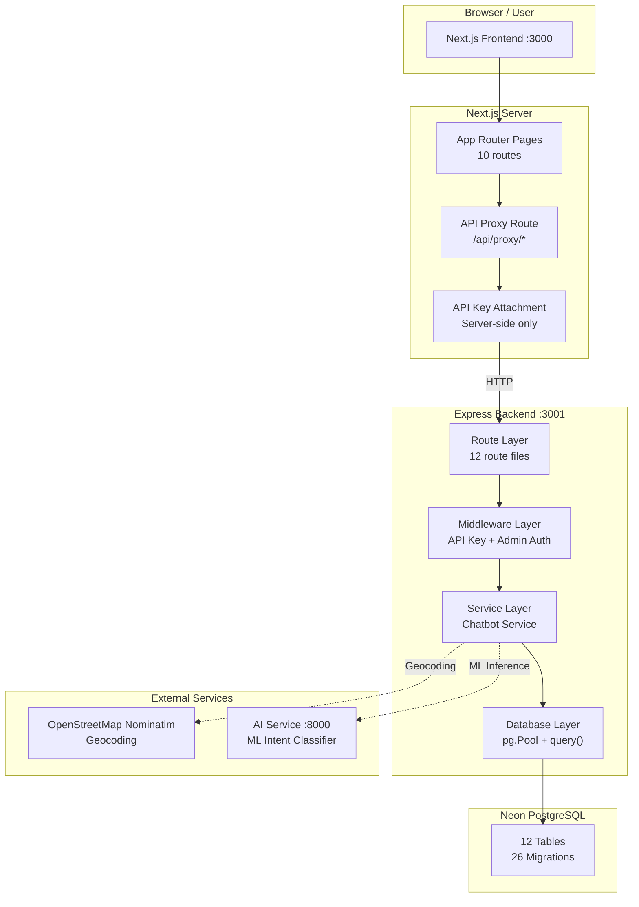

### Layer Descriptions

| Layer | Technology | Responsibility |
|---|---|---|
| Client | Browser | User interaction, rendering |
| Frontend | Next.js 16 + React 19 | Page rendering, UI components, state management |
| API Proxy | Next.js Route Handler | Server-side API key attachment, request forwarding |
| Backend | Express.js + TypeScript | API routing, business logic, validation |
| Middleware | Express middleware | Authentication, authorization |
| Services | TypeScript modules | Chatbot AI, knowledge retrieval, intent detection |
| Database | Neon PostgreSQL | Data persistence, search, aggregation |
| External | HTTP APIs | Geocoding, ML inference |

---

## 5. Technology Stack

| Technology | Version | Purpose | Where Used |
|---|---|---|---|
| Next.js | 16.3.2 | Frontend framework | Frontend — App Router, SSR, API proxy |
| React | 19.2.8 | UI library | Frontend — Component architecture, hooks |
| TypeScript | 5.x | Type safety | Frontend + Backend — Reduces runtime errors |
| Tailwind CSS | 4.x | Styling | Frontend — Utility-first, design tokens |
| motion/react | 13.1.1 | Animations | Frontend — Scroll animations, page transitions |
| Express.js | 4.21 | Backend API | Backend — Lightweight, flexible routing |
| pg (node-postgres) | 8.23 | PostgreSQL client | Backend — Parameterized queries, connection pooling |
| Neon PostgreSQL | — | Database | Database — Serverless, PostgreSQL-compatible |
| lucide-react | 1.34 | Icons | Frontend — Consistent icon system across UI |
| Leaflet | 1.9.4 | Map rendering | Frontend map components — Open-source maps |
| react-leaflet | 5.0 | React map bindings | Frontend map components |
| Geist_Mono | — | Monospace font | Frontend — Code/data display |

---

## 6. Project Folder Structure

```
Astrova/
├── .env                          # Environment secrets (GITIGNORED)
├── .env.example                  # Environment template
├── .gitignore
├── package.json                  # Root monorepo scripts
├── README.md
│
├── ai-service/                   # Python ML intent classifier
│   └── app/
│       ├── main.py               # FastAPI server
│       ├── api/predict.py        # Intent prediction endpoint
│       └── models/
│           └── intent_classifier.py
│
├── backend/                      # Express.js API server
│   ├── package.json
│   ├── tsconfig.json
│   └── src/
│       ├── index.ts              # Entry point, route registration
│       ├── config/
│       │   ├── index.ts          # App configuration
│       │   └── languages.ts      # Language definitions, greetings
│       ├── database/
│       │   ├── index.ts          # pg.Pool, query() wrapper
│       │   └── helpers.ts        # requireDatabase helper
│       ├── middleware/
│       │   ├── apiKey.ts         # X-API-Key validation
│       │   ├── admin.ts          # X-Admin-Token validation
│       │   └── validate.ts       # Input validation helpers
│       ├── routes/
│       │   ├── admin.ts          # Admin CRUD + analytics (10 endpoints)
│       │   ├── ai.ts             # Chatbot endpoints (4 endpoints)
│       │   ├── collections.ts    # Collection listing + detail (3 endpoints)
│       │   ├── health.ts         # Health check
│       │   ├── heritage.ts       # Heritage CRUD + state-counts (3 endpoints)
│       │   ├── locations.ts      # Location listing + detail
│       │   ├── media.ts          # Media listing + detail
│       │   ├── periods.ts        # Historical periods listing
│       │   ├── search.ts         # Search + suggestions (2 endpoints)
│       │   ├── sources.ts        # Source listing + detail
│       │   ├── system.ts         # System connectivity
│       │   └── timeline.ts       # Timeline data
│       ├── services/
│       │   └── chatbot.ts        # Chatbot: intent, retrieval, response
│       ├── utils/
│       │   ├── slug.ts           # Slug/UUID validation
│       │   └── validation.ts     # Category/parameter validation
│       ├── models/               # TypeScript interfaces
│       ├── controllers/          # (reserved)
│       ├── types/                # Type definitions
│       └── validators/           # (reserved)
│
├── frontend/                     # Next.js App Router
│   ├── package.json
│   ├── next.config.ts
│   ├── tsconfig.json
│   ├── postcss.config.mjs
│   ├── .env.local                # Frontend env (API_BASE_URL)
│   └── app/
│       ├── layout.tsx            # Root layout: fonts (Playfair, Manrope), Navbar, Footer
│       ├── page.tsx              # Home page: hero, states, timeline, collections, featured
│       ├── globals.css           # Global styles, Tailwind config
│       ├── explore/
│       │   ├── page.tsx          # Interactive map + search + state selection
│       │   └── [id]/page.tsx     # Location detail
│       ├── heritage/
│       │   ├── page.tsx          # Heritage listing: search, category, state, period filters
│       │   └── [id]/page.tsx     # Heritage detail: hero, gallery, relationships, lightbox
│       ├── collections/
│       │   ├── page.tsx          # Collections grid
│       │   └── [slug]/page.tsx   # Collection detail + related collections
│       ├── timeline/page.tsx     # Timeline: search, category filter, period cards
│       ├── ai/page.tsx           # AI chatbot page
│       ├── favorites/page.tsx    # Favorites page (localStorage-based)
│       ├── admin/page.tsx        # Admin dashboard with auth gate
│       ├── about/page.tsx        # About page
│       ├── (public)/             # Shared public layouts
│       └── api/proxy/
│           └── [...path]/route.ts # API proxy: attaches API key server-side
│
├── frontend/components/
│   ├── layout/
│   │   ├── Navbar.tsx            # Navigation: Explore, Timeline, Heritage, Collections, Favorites, Ask AI, About
│   │   └── Footer.tsx            # Footer with state links
│   ├── ui/
│   │   ├── Badge.tsx
│   │   ├── Breadcrumb.tsx
│   │   ├── Button.tsx
│   │   ├── Card.tsx
│   │   ├── Container.tsx
│   │   ├── EmptyState.tsx
│   │   ├── ErrorState.tsx
│   │   ├── FavoriteButton.tsx    # Heart toggle (localStorage)
│   │   ├── GalleryLightbox.tsx   # Full-featured gallery viewer
│   │   ├── Input.tsx
│   │   ├── LoadingState.tsx
│   │   ├── Modal.tsx
│   │   ├── SearchInput.tsx
│   │   ├── SearchModal.tsx
│   │   ├── SearchSuggestions.tsx  # Debounced autocomplete dropdown
│   │   ├── SectionHeading.tsx
│   │   └── Tabs.tsx
│   ├── map/
│   │   ├── AstrovaMap.tsx        # Main map component (Leaflet)
│   │   ├── HeritagePopup.tsx     # Marker popup with entity info
│   │   ├── MapControls.tsx       # State/category/period filters
│   │   └── MapDetailPanel.tsx    # Expanded entity view
│   ├── motion/
│   │   ├── FadeIn.tsx
│   │   ├── Stagger.tsx
│   │   └── CountUp.tsx
│   ├── heritage/                 # Heritage-specific components
│   ├── ai/                       # Chatbot UI components
│   ├── graph/                    # Relationship graph
│   └── timeline/                 # Timeline components
│
├── frontend/hooks/
│   ├── useApi.ts                 # Generic API data fetching hook
│   └── useFavorites.ts           # localStorage favorites hook
│
├── frontend/services/
│   └── api.ts                    # API client (proxy-based, server-side key)
│
├── frontend/lib/
│   └── analytics.ts              # Analytics event tracking (fire-and-forget)
│
├── frontend/constants/
│   ├── index.ts                  # API_BASE_URL and app constants
│   ├── india.ts                  # INDIAN_STATES data (12 states)
│   └── images.ts                 # Fallback images for heritage entities
│
├── frontend/styles/              # Additional stylesheets
├── frontend/types/               # TypeScript type definitions
├── frontend/data/                # GeoJSON data for states/regions
├── frontend/public/              # Static assets
│
├── database/
│   └── migrations/               # 26 SQL migration files
│       ├── 001_initial_schema.sql
│       ├── 002_multistate_chatbot.sql
│       ├── 003_regional_expansion.sql
│       ├── 004_p1_canonical_ids.sql
│       ├── 005_p1_sources.sql
│       ├── ...
│       ├── 025_p1_collections.sql
│       └── 026_p1_admin_analytics_favorites.sql
│
├── docs/
│   ├── p1/                       # Implementation reports P1.1 through P1.29
│   ├── audit/                    # Project audit documents
│   ├── project/                  # Project-level documentation
│   ├── api/                      # API documentation
│   ├── database/                 # Database setup guides
│   ├── development/              # Development guides
│   └── frontend/                 # Frontend documentation
│
├── ml/                           # ML training data
│   ├── data/                     # Training/test CSV files
│   └── models/                   # Evaluation metrics
│
├── ai-service/                   # Python ML service
├── scripts/                      # Utility scripts
├── testing/                      # Test files
├── backups/                      # Database backups
└── exports/                      # Data exports
```

---

## 7. Database Architecture

### Tables Overview

| # | Table | Purpose | Row Count |
|---|---|---|---|
| 1 | `supported_states` | 12 Indian states with metadata | 12 |
| 2 | `locations` | Geographic locations (lat/lon, hierarchy) | 54 |
| 3 | `heritage_entities` | Core heritage records | 74 |
| 4 | `historical_periods` | Time periods (Ancient, Medieval, etc.) | 9 |
| 5 | `sources` | Information sources and citations | 18 |
| 6 | `media` | Images, documents, audio, video | 72 |
| 7 | `relationships` | Heritage entity-to-entity connections | 49 |
| 8 | `chatbot_knowledge` | Multilingual chatbot knowledge base | 107 |
| 9 | `collections` | Curated heritage collections | 6 |
| 10 | `collection_items` | Collection-entity junction table | 98 |
| 11 | `analytics_events` | Usage analytics event log | 0 |
| 12 | `conversation_messages` | Chat conversation history | (transient) |

### Key Design Decisions

- **UUID primary keys** throughout for security and distributed compatibility
- **Foreign key constraints** with CASCADE/SET NULL for data integrity
- **PostgreSQL full-text search** (tsvector/tsquery) for chatbot knowledge
- **GIN indexes** on heritage name/description for fast search
- **Composite unique constraints** to prevent duplicate associations
- **JSONB** for flexible analytics event metadata

---

## 8. E-R Diagram

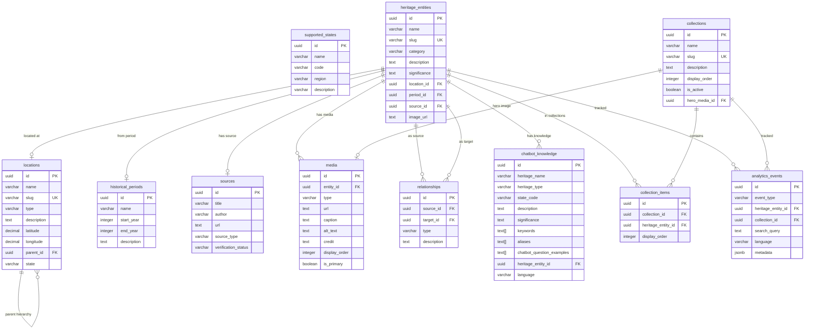

---

## 9. Data Dictionary

### Table: `heritage_entities` (74 rows)

| Column | Type | Nullable | Default | Constraints | Description |
|---|---|---|---|---|---|
| id | UUID | NO | gen_random_uuid() | PRIMARY KEY | Unique identifier |
| name | VARCHAR(255) | NO | — | NOT NULL | Heritage entity name |
| slug | VARCHAR(255) | NO | — | UNIQUE | URL-friendly identifier |
| category | VARCHAR(50) | NO | — | CHECK (9 values) | monument, person, craft, tradition, festival, architecture, event, food, community, + natural categories |
| description | TEXT | NO | — | NOT NULL | Full description (300+ chars) |
| significance | TEXT | YES | — | — | Cultural significance |
| location_id | UUID | YES | — | FK → locations.id | Geographic location |
| period_id | UUID | YES | — | FK → historical_periods.id | Historical period |
| source_id | UUID | YES | — | FK → sources.id | Information source |
| image_url | TEXT | YES | — | — | Fallback image URL |
| created_at | TIMESTAMP | NO | NOW() | — | Creation timestamp |
| updated_at | TIMESTAMP | NO | NOW() | — | Last update timestamp |

### Table: `media` (72 rows)

| Column | Type | Nullable | Default | Constraints | Description |
|---|---|---|---|---|---|
| id | UUID | NO | gen_random_uuid() | PRIMARY KEY | Unique identifier |
| entity_id | UUID | NO | — | FK → heritage_entities.id ON DELETE CASCADE | Associated entity |
| type | VARCHAR(50) | NO | — | CHECK (image, document, audio, video) | Media type |
| url | TEXT | NO | — | NOT NULL | Media URL |
| caption | TEXT | YES | — | — | Display caption |
| alt_text | TEXT | YES | — | — | Accessibility alt text |
| credit | TEXT | YES | — | — | Source/photographer credit |
| display_order | INTEGER | YES | 0 | — | Sort order within entity |
| is_primary | BOOLEAN | NO | false | — | Primary display image flag |
| verification_status | VARCHAR(50) | YES | — | — | VERIFIED, REVIEWED, PENDING |

### Table: `locations` (54 rows)

| Column | Type | Nullable | Default | Constraints | Description |
|---|---|---|---|---|---|
| id | UUID | NO | gen_random_uuid() | PRIMARY KEY | Unique identifier |
| name | VARCHAR(255) | NO | — | NOT NULL | Location name |
| slug | VARCHAR(255) | NO | — | UNIQUE | URL-friendly slug |
| type | VARCHAR(50) | NO | — | CHECK (state, district, city, village, site) | Location type |
| description | TEXT | YES | — | — | Location description |
| latitude | DECIMAL(10,8) | YES | — | — | GPS latitude |
| longitude | DECIMAL(11,8) | YES | — | — | GPS longitude |
| parent_id | UUID | YES | — | FK → locations.id | Parent location hierarchy |
| state | VARCHAR(100) | YES | 'Gujarat' | — | State name |

**Indexes:** idx_locations_type, idx_locations_parent, idx_locations_state, idx_locations_slug

### Table: `historical_periods` (9 rows)

| Column | Type | Nullable | Default | Constraints | Description |
|---|---|---|---|---|---|
| id | UUID | NO | gen_random_uuid() | PRIMARY KEY | Unique identifier |
| name | VARCHAR(255) | NO | — | NOT NULL | Period name |
| start_year | INTEGER | NO | — | NOT NULL | Start year (negative = BCE) |
| end_year | INTEGER | YES | — | — | End year (NULL = ongoing) |
| description | TEXT | YES | — | — | Period description |

### Table: `relationships` (49 rows)

| Column | Type | Nullable | Default | Constraints | Description |
|---|---|---|---|---|---|
| id | UUID | NO | gen_random_uuid() | PRIMARY KEY | Unique identifier |
| source_id | UUID | NO | — | FK → heritage_entities.id ON DELETE CASCADE | Source entity |
| target_id | UUID | NO | — | FK → heritage_entities.id ON DELETE CASCADE | Target entity |
| type | VARCHAR(100) | NO | — | CHECK (10 types) | LOCATED_IN, ASSOCIATED_WITH, PRACTICED_BY, PART_OF, INFLUENCED_BY, BUILT_BY, etc. |
| description | TEXT | YES | — | — | Relationship description |

### Table: `chatbot_knowledge` (107 rows)

| Column | Type | Nullable | Default | Constraints | Description |
|---|---|---|---|---|---|
| id | UUID | NO | gen_random_uuid() | PRIMARY KEY | Unique identifier |
| heritage_name | VARCHAR(255) | NO | — | NOT NULL | Display name |
| heritage_type | VARCHAR(50) | NO | — | NOT NULL | Type category |
| state_code | VARCHAR(10) | NO | — | NOT NULL | Two-letter state code |
| description | TEXT | YES | — | — | Chatbot description |
| significance | TEXT | YES | — | — | Cultural significance |
| keywords | TEXT[] | YES | — | — | Search keywords array |
| aliases | TEXT[] | YES | — | — | Alternative names array |
| chatbot_question_examples | TEXT[] | YES | — | — | Example user questions |
| heritage_entity_id | UUID | YES | — | FK → heritage_entities.id | Linked entity |
| language | VARCHAR(10) | NO | 'en' | NOT NULL | en, gu, hi, mr, ta, pa |

**Unique constraint:** idx_chatbot_knowledge_entity_lang ON (heritage_entity_id, language) WHERE heritage_entity_id IS NOT NULL

### Table: `collections` (6 rows)

| Column | Type | Nullable | Default | Constraints | Description |
|---|---|---|---|---|---|
| id | UUID | NO | gen_random_uuid() | PRIMARY KEY | Unique identifier |
| name | VARCHAR(200) | NO | — | NOT NULL | Collection name |
| slug | VARCHAR(200) | NO | — | UNIQUE | URL-friendly slug |
| description | TEXT | YES | — | — | Collection description |
| image_url | VARCHAR(500) | YES | — | — | Legacy image URL |
| display_order | INTEGER | NO | 0 | — | Editorial sort order |
| is_active | BOOLEAN | NO | true | — | Active/inactive toggle |
| hero_media_id | UUID | YES | — | FK → media.id ON DELETE SET NULL | Editorial hero image |
| created_at | TIMESTAMP WITH TIME ZONE | NO | NOW() | — | Creation timestamp |

### Table: `collection_items` (98 rows)

| Column | Type | Nullable | Default | Constraints | Description |
|---|---|---|---|---|---|
| id | UUID | NO | gen_random_uuid() | PRIMARY KEY | Unique identifier |
| collection_id | UUID | NO | — | FK → collections.id ON DELETE CASCADE | Parent collection |
| heritage_entity_id | UUID | NO | — | FK → heritage_entities.id ON DELETE CASCADE | Heritage entity |
| display_order | INTEGER | NO | 0 | — | Editorial sort order |
| created_at | TIMESTAMP WITH TIME ZONE | NO | NOW() | — | Creation timestamp |

**Unique constraint:** UNIQUE(collection_id, heritage_entity_id)

### Table: `analytics_events` (0 rows — empty)

| Column | Type | Nullable | Default | Constraints | Description |
|---|---|---|---|---|---|
| id | UUID | NO | gen_random_uuid() | PRIMARY KEY | Unique identifier |
| event_type | VARCHAR(50) | NO | — | NOT NULL | heritage_view, search, collection_view, chatbot_query, favorite_add, favorite_remove |
| heritage_entity_id | UUID | YES | — | FK → heritage_entities.id ON DELETE SET NULL | Associated entity |
| collection_id | UUID | YES | — | FK → collections.id ON DELETE SET NULL | Associated collection |
| search_query | TEXT | YES | — | — | Search text |
| language | VARCHAR(10) | YES | — | — | Query language |
| metadata | JSONB | YES | — | — | Additional event data |
| created_at | TIMESTAMP WITH TIME ZONE | NO | NOW() | — | Event timestamp |

---

## 10. Backend Architecture

### Entry Point: `backend/src/index.ts`

The Express application follows a clean, modular architecture:

1. **Environment Loading** — `dotenv.config()` loads `.env` from project root
2. **Express Setup** — CORS (origin allowed in development), JSON body parser
3. **Route Registration** — 12 route modules mounted under `/api/*`
4. **Error Handling** — 404 handler + global error handler
5. **Server Start** — Listens on port 3001

### Route Registration Order (Critical)

```
/api/health       → health.ts      (no auth)
/api/system       → system.ts      (no auth)
/api/locations    → locations.ts   (API key)
/api/heritage     → heritage.ts    (API key) — /state-counts BEFORE /:id
/api/timeline     → timeline.ts    (API key)
/api/search       → search.ts      (API key)
/api/sources      → sources.ts     (API key)
/api/media        → media.ts       (API key)
/api/periods      → periods.ts     (API key)
/api/collections  → collections.ts (API key)
/api/admin        → admin.ts       (Admin token)
/api/ai           → ai.ts          (API key)
```

### Middleware Stack

| Middleware | File | Applied To | Purpose |
|---|---|---|---|
| `cors()` | Express built-in | All routes | Cross-origin requests |
| `express.json()` | Express built-in | All routes | JSON body parsing |
| `requireDevelopmentApiKey` | `middleware/apiKey.ts` | All public API routes | X-API-Key validation |
| `requireAdmin` | `middleware/admin.ts` | All `/api/admin/*` routes | X-Admin-Token validation |

### API Key Validation Flow

1. Read `DEMO_API_KEY` from environment
2. Read `X-API-Key` from request header
3. If key not configured → 401 (fail-safe)
4. If key missing from request → 401
5. **Constant-time comparison** (prevents timing attacks)
6. If match → pass to route handler
7. If no match → 401

### Database Access Pattern

All database access flows through `backend/src/database/index.ts`:

- **Lazy pool initialization** — Connection pool created on first query
- **SSL enabled** — Required for Neon PostgreSQL
- **Max 10 connections** — With 30s idle timeout
- **`query(text, params)` wrapper** — All queries use parameterized SQL (no string concatenation)
- **Error handling** — Pool errors logged, never expose credentials

---

## 11. API Documentation

### Public APIs (X-API-Key required)

| # | Method | Endpoint | Purpose | Query Parameters |
|---|---|---|---|---|
| 1 | GET | /api/heritage | List heritage entities | q, category, state, period, sort, order |
| 2 | GET | /api/heritage/state-counts | Heritage counts by state | — |
| 3 | GET | /api/heritage/:id | Get entity by UUID or slug | — |
| 4 | GET | /api/search | Full-text search | q, category, state, type, period, sort, order |
| 5 | GET | /api/search/suggestions | Autocomplete suggestions | q (min 2 chars) |
| 6 | GET | /api/periods | List historical periods | — |
| 7 | GET | /api/timeline | Timeline with entities | — |
| 8 | GET | /api/locations | List locations | — |
| 9 | GET | /api/media | List media records | — |
| 10 | GET | /api/collections | List active collections | — |
| 11 | GET | /api/collections/:slug | Collection detail + entities | — |
| 12 | GET | /api/collections/:slug/related | Related collections | — |
| 13 | GET | /api/sources | List sources | — |
| 14 | POST | /api/ai/chat | Chatbot message | body: {message, language} |
| 15 | GET | /api/ai/welcome | Welcome message | language |
| 16 | GET | /api/ai/suggestions | Context suggestions | language, intent, state |
| 17 | GET | /api/ai/languages | Supported languages | — |
| 18 | GET | /api/health | Health check | — |
| 19 | GET | /api/system/connectivity | DB connectivity test | — |

### Admin APIs (X-API-Key + X-Admin-Token required)

| # | Method | Endpoint | Purpose | Request Body |
|---|---|---|---|---|
| 20 | GET | /api/admin/overview | Dashboard overview | — |
| 21 | GET | /api/admin/heritage | List heritage (filtered) | query: q, category, state, period |
| 22 | PUT | /api/admin/heritage/:id | Update heritage entity | body: {name, category, description, period_id, location_id} |
| 23 | GET | /api/admin/collections | List collections | — |
| 24 | POST | /api/admin/collections | Create collection | body: {name, slug, description, display_order, hero_media_id} |
| 25 | PUT | /api/admin/collections/:id | Update collection | body: {name, slug, description, display_order, is_active, hero_media_id} |
| 26 | POST | /api/admin/collections/:id/items | Add collection item | body: {heritage_entity_id, display_order} |
| 27 | DELETE | /api/admin/collections/:id/items/:itemId | Remove collection item | — |
| 28 | POST | /api/admin/analytics/track | Record analytics event | body: {event_type, heritage_entity_id, collection_id, search_query, language, metadata} |
| 29 | GET | /api/admin/analytics/overview | Analytics aggregation | query: days (default 30) |

### Response Format

All API responses follow a consistent format:

```json
{
  "success": true,
  "data": { ... },
  "total": 74,
  "query": "temple"
}
```

Error responses:

```json
{
  "success": false,
  "error": {
    "code": "INVALID_QUERY_PARAMETER",
    "message": "Search query must be between 1 and 500 characters"
  }
}
```

---

## 12. API Flow Diagram

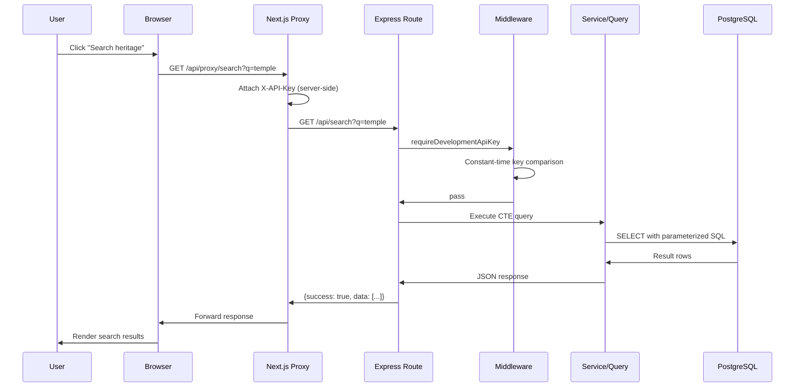

---

## 13. Data Flow Diagrams

### DFD Level 0 — Context Diagram

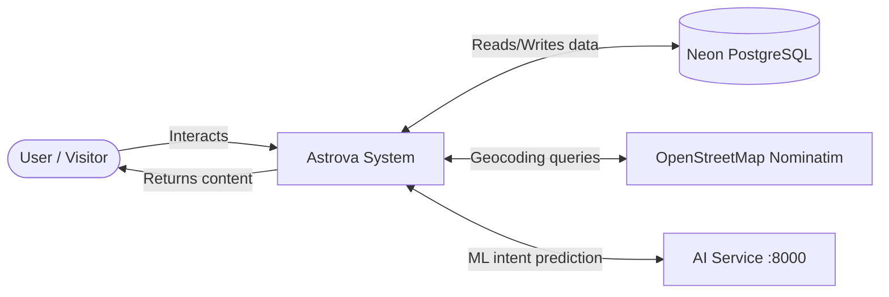

### DFD Level 1 — Major Processes

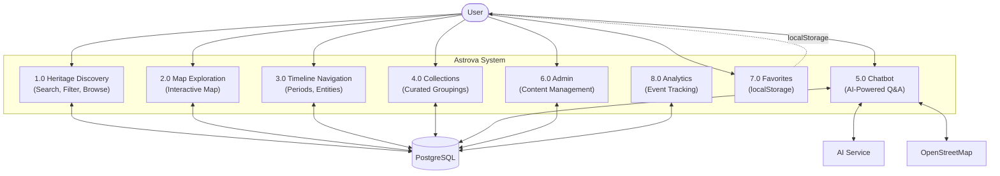

### DFD Level 2 — Chatbot Subsystem

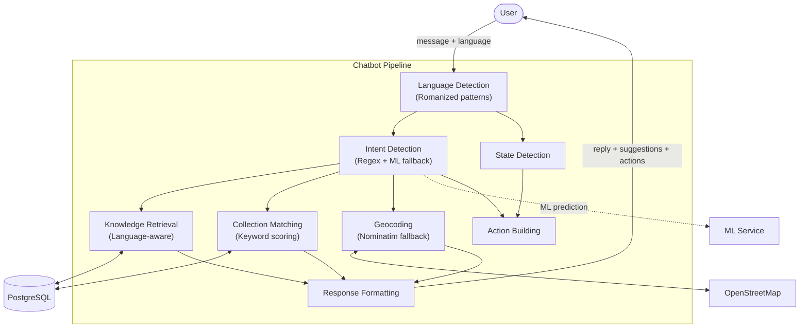

---

## 14. Use-Case Diagram

```
┌──────────────────────────────────────────────────────────────────┐
│                        ASTROVA SYSTEM                            │
│                                                                  │
│  ┌──────────────────────┐    ┌──────────────────────────────┐   │
│  │ Browse Heritage       │    │ Search Heritage              │   │
│  │ Filter by State       │    │ Search Suggestions           │   │
│  │ Filter by Category    │    │ Search by Period             │   │
│  │ View Heritage Detail  │    └──────────────────────────────┘   │
│  │ View Gallery          │                                       │
│  │ View Relationships    │    ┌──────────────────────────────┐   │
│  │ Favorite Heritage     │    │ Explore Interactive Map       │   │
│  └──────────────────────┘    │ Filter Map by State/Category  │   │
│                               │ View Heritage Markers          │   │
│  ┌──────────────────────┐    │ View Popups with Info          │   │
│  │ View Timeline         │    └──────────────────────────────┘   │
│  │ Navigate Periods      │                                       │
│  │ Filter by Category    │    ┌──────────────────────────────┐   │
│  └──────────────────────┘    │ Use AI Chatbot                │   │
│                               │ Ask Heritage Questions         │   │
│  ┌──────────────────────┐    │ Select Language (6)            │   │
│  │ Browse Collections    │    │ Get Collection Suggestions     │   │
│  │ View Collection Detail│    │ View Map/Timeline Actions      │   │
│  │ View Related Colls    │    └──────────────────────────────┘   │
│  └──────────────────────┘                                        │
│                                                                  │
│  ┌──────────────────────┐    ┌──────────────────────────────┐   │
│  │ Admin Dashboard       │    │ Manage Heritage (CRUD)       │   │
│  │ View Analytics        │    │ Manage Collections (CRUD)     │   │
│  │ View Overview Stats   │    │ Track Analytics Events        │   │
│  └──────────────────────┘    └──────────────────────────────┘   │
└──────────────────────────────────────────────────────────────────┘

Actors:
  ○ Visitor/User ──────── connects to all public use cases
  ○ Administrator ─────── connects to admin use cases
  ○ OpenStreetMap ──────── external geocoding service
  ○ AI Service ─────────── external ML intent classifier
```

---

## 15. Class/Component Diagram

### Frontend Component Hierarchy

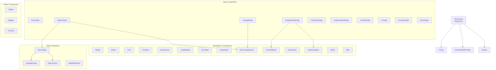

### Backend Module Hierarchy

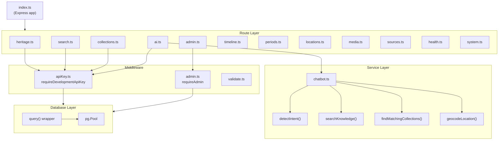

---

## 16. Activity Diagram — Primary User Journey

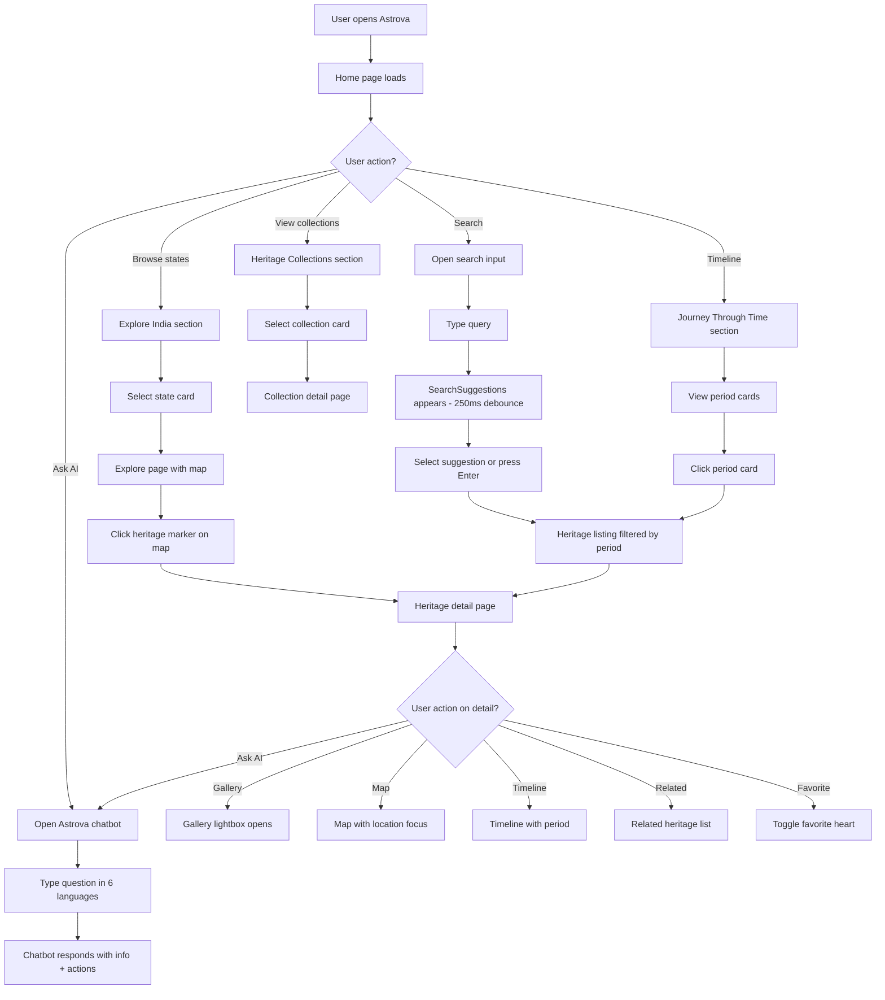

---

## 17. Chatbot Activity Flow

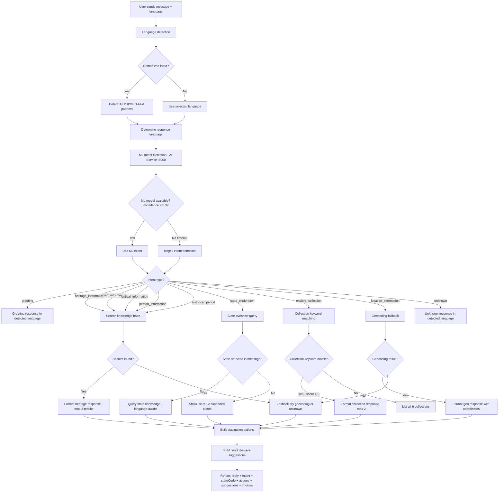

---

## 18. Sequence Diagrams

### Search Flow

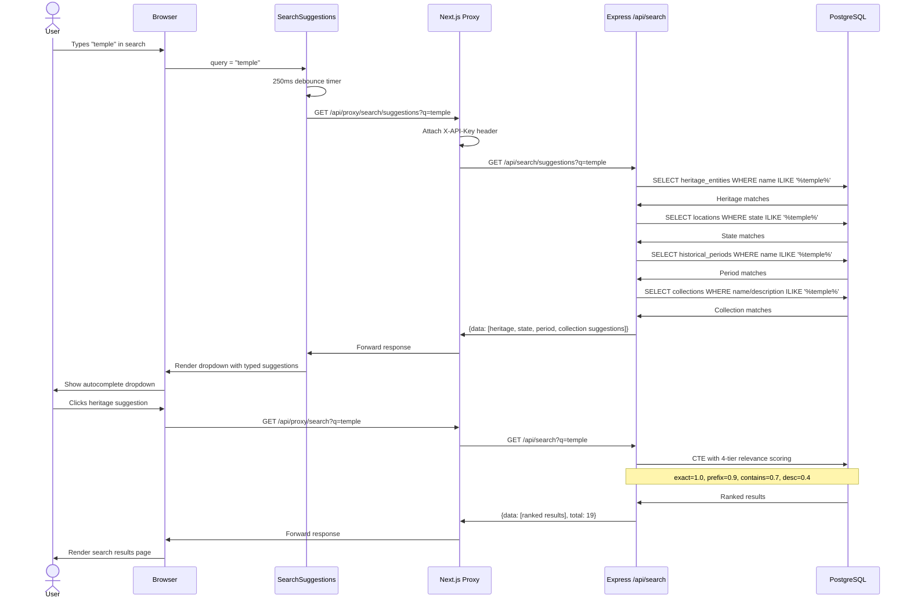

### Chatbot Flow

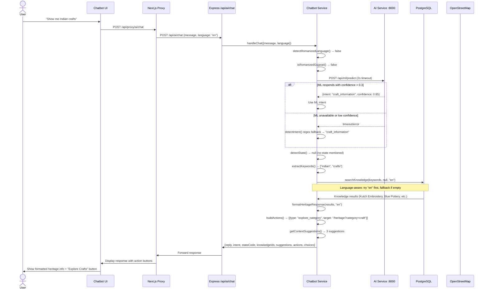

### Admin Flow

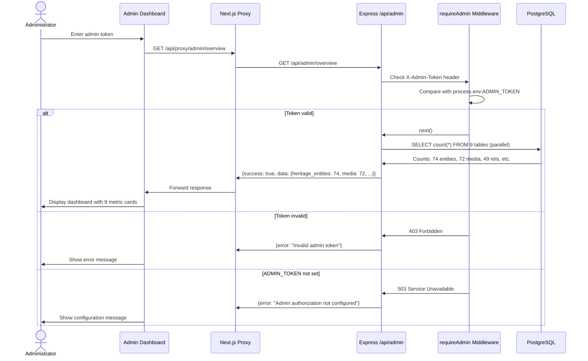

---

## 19. Heritage Discovery Flow

Users can discover heritage through **9 interconnected paths**:

### Path 1: Home Page
Home → State cards (12 states) → Explore page with map → Heritage markers → Heritage detail

### Path 2: Explore / Map
Explore → Interactive map → State/category/period filters → Click marker → Popup with info → Heritage detail

### Path 3: Heritage Listing
Heritage page → Search input → Category filter → State filter → Period filter → Sort → Heritage cards → Heritage detail

### Path 4: Search Suggestions
Any search input → 250ms debounce → Suggestions dropdown (heritage, state, period, category, collection) → Click suggestion → Destination page

### Path 5: Collections
Collections page → 6 curated collections → Collection detail → Entity grid → Heritage detail

### Path 6: Timeline
Timeline page → 9 historical periods → Search/filter → Period card → Heritage entities in period → Heritage detail

### Path 7: Chatbot
AI page → Type question → Chatbot response → Action buttons (View Details, View on Map, Explore State, View Timeline, Browse Collections)

### Path 8: Related Heritage
Heritage detail → Related Heritage section → Grouped by relationship type → Click related entity → New heritage detail

### Path 9: Favorites
Heritage listing/detail → Click heart → Favorites page → View saved heritage

### Discovery Path Interconnections

```
Home ──────┬──→ Explore/Map ───→ Heritage Detail
           ├──→ Heritage Listing ──→ Heritage Detail
           ├──→ Collections ────→ Collection Detail → Heritage Detail
           ├──→ Timeline ───────→ Heritage Listing → Heritage Detail
           ├──→ Chatbot ────────→ Heritage Detail / Map / Timeline / Collections
           └──→ About

Heritage Detail ──┬──→ Map (View on Map)
                  ├──→ Timeline (Explore Period)
                  ├──→ Chatbot (Ask Astrova)
                  ├──→ Related Heritage
                  ├──→ Favorites
                  └──→ Heritage Listing (Browse All)
```

---

## 20. Search Architecture

### Backend: Search API (`/api/search`)

**CTE-based search** with unified heritage + location results:

```sql
WITH combined AS (
  -- Heritage branch: match name or description
  SELECT ... relevance scoring ...
  FROM heritage_entities he
  LEFT JOIN locations l ON he.location_id = l.id
  LEFT JOIN historical_periods hp ON he.period_id = hp.id
  WHERE he.name ILIKE $2 OR he.description ILIKE $3

  UNION ALL

  -- Location branch: match name or description
  SELECT ... relevance scoring ...
  FROM locations l
  WHERE l.name ILIKE $2 OR l.description ILIKE $3
)
SELECT * FROM combined
WHERE [dynamic filters]
ORDER BY [relevance | name | state]
LIMIT 50
```

### Relevance Ranking (4-tier scoring)

| Tier | Condition | Score |
|---|---|---|
| 1 | Exact name match | 1.0 |
| 2 | Name starts with query (ILIKE prefix) | 0.9 |
| 3 | Name contains query (ILIKE contains) | 0.7 |
| 4 | Description contains query | 0.4 |

### Search Suggestions (`/api/search/suggestions`)

Aggregates 5 suggestion types from parallel queries:
1. **Heritage** — entity names matching query (limit 5)
2. **States** — location states matching query (limit 3)
3. **Periods** — historical period names matching query (limit 3)
4. **Categories** — matching category names (limit 2)
5. **Collections** — collection names/descriptions matching query (limit 2)

### Frontend: SearchSuggestions Component

- **Debounce:** 250ms delay before API call
- **Keyboard navigation:** ArrowUp, ArrowDown, Enter, Escape
- **Touch-friendly:** 44px minimum touch targets
- **Type indicators:** Color-coded icons for heritage (gold), state (terracotta), period, category, collection
- **Click-outside closing:** Closes when clicking outside the dropdown
- **Loading state:** Spinner indicator during API call
- **Error handling:** Graceful failure, no crash

---

## 21. Map Architecture

### Components

| Component | Purpose |
|---|---|
| `AstrovaMap.tsx` | Main Leaflet map with markers and popups |
| `MapControls.tsx` | State, category, and period filter controls |
| `HeritagePopup.tsx` | Marker popup showing entity info + action buttons |
| `MapDetailPanel.tsx` | Expanded entity view panel |

### Map Features

- **Heritage markers** — Placed at location coordinates from `locations` table
- **State filtering** — Filter markers by state
- **Category filtering** — Filter markers by heritage category
- **Period filtering** — Filter markers by historical period
- **Popups** — Click marker to see entity name, category, period, description snippet
- **Actions** — "View Heritage" and "Ask Atlas" buttons in popup
- **Focus navigation** — Heritage detail → Map focuses on location via `/explore?focus=<locationId>`

### External Dependencies

- **Leaflet** — Open-source map rendering library
- **react-leaflet** — React bindings for Leaflet
- **MapTiler** — Map tile provider (via API key)
- **OpenStreetMap** — Base map data

---

## 22. Timeline Architecture

### Data Source

- **GET /api/timeline** returns periods with nested entities and media
- **GET /api/periods** returns lightweight period metadata

### Timeline Page Features

- **Vertical timeline layout** — Periods displayed chronologically
- **Search** — Filter heritage by name within timeline
- **Category filter** — Filter by heritage category
- **Period navigation** — Click period to see associated entities
- **Entity counts** — Each period shows heritage count
- **Media thumbnails** — Entity images displayed in timeline cards
- **Empty states** — Graceful handling when no results match filters

### Timeline → Heritage Flow

```
Timeline page → Period card → Heritage entities grid → Heritage detail
```

---

## 23. Collection Architecture

### Database

- **`collections`** — 6 curated collections with editorial metadata
- **`collection_items`** — Junction table with display ordering
- **`hero_media_id`** — Editorial hero image control (nullable, falls back to primary media)

### Collections

| Collection | Slug | Entities | Description |
|---|---|---|---|
| Sacred Architecture | sacred-architecture | 21 | Temples, stepwells, mosques, architectural masterpieces |
| Indian Crafts | indian-crafts | 11 | Traditional arts and crafts |
| Living Traditions | living-traditions | 23 | Cultural practices, festivals, communities, food |
| Natural Heritage | natural-heritage | 15 | Natural landscapes, waterfalls, wildlife |
| Ancient India | ancient-india | 12 | Heritage from earliest civilizations |
| First-Time Explorer's Guide | first-time-explorers | 16 | Essential heritage experience |

### Collection APIs

| Endpoint | Purpose |
|---|---|
| GET /api/collections | List all active collections with entity counts and hero images |
| GET /api/collections/:slug | Collection detail with ordered heritage entities |
| GET /api/collections/:slug/related | Related collections based on shared entities |

### Related Collections Algorithm

1. Get current collection's heritage entity IDs
2. For each other active collection, count shared entities
3. Rank by shared_count DESC, then entity_count DESC
4. Return top 3 related collections

### Chatbot Collection Discovery

The chatbot can suggest collections based on keyword matching:

```javascript
COLLECTION_KEYWORDS = {
  "sacred-architecture": ["temple", "fort", "palace", "stepwell", "monument", "architecture"],
  "indian-crafts": ["craft", "handicraft", "weaving", "embroidery", "pottery", "artisan"],
  "living-traditions": ["tradition", "festival", "food", "cultural", "community", "living"],
  "natural-heritage": ["natural", "waterfall", "wildlife", "beach", "mountain", "river"],
  "ancient-india": ["ancient", "classical", "early", "indus", "chola", "kalinga"],
  "first-time-explorers": ["first time", "beginner", "must see", "essential", "famous"],
};
```

---

## 24. Favorites Architecture

### Implementation

- **Storage:** localStorage (key: `astrova_favorites`)
- **Hook:** `useFavorites()` — provides `favorites`, `isFavorited()`, `toggleFavorite()`, `addFavorite()`, `removeFavorite()`
- **Component:** `FavoriteButton` — heart toggle with filled/unfilled states
- **Page:** `/favorites` — grid of favorited heritage with images

### Data Flow

```
User clicks heart → useFavorites.toggleFavorite(id) → localStorage.setItem() → re-render
```

### Current Limitations

- No server-side persistence
- Cannot sync across devices
- Lost if user clears browser data
- No user account association

### Future Architecture (Planned)

```
User clicks heart → POST /api/favorites/:heritageId → JWT auth → PostgreSQL favorites table → re-render
```

---

## 25. Analytics Architecture

### Event Types

| Event Type | Description |
|---|---|
| heritage_view | User views a heritage detail page |
| search | User performs a search |
| collection_view | User views a collection |
| chatbot_query | User sends a chatbot message |
| favorite_add | User adds a heritage to favorites |
| favorite_remove | User removes a heritage from favorites |

### Tracking Library

`frontend/lib/analytics.ts` — `trackEvent()` function:
- Fire-and-forget (failures silently ignored)
- Sends to `/api/admin/analytics/track`
- No PII collected

### Admin Analytics

`GET /api/admin/analytics/overview` returns:
- Total events (within configurable day window)
- Events grouped by type
- Top heritage entities by views
- Top search queries
- Top collections by views

### Current State

- Table exists and is functional
- Currently empty (no user traffic yet)
- Ready to populate when frontend tracking is wired up

---

## 26. Admin Architecture

### Authentication

- **Token-based:** `X-Admin-Token` header validated against `ADMIN_TOKEN` env variable
- **Not configured by default** — returns 503 with clear message
- **No JWT/session** — lightweight placeholder for future auth

### Dashboard (`/admin`)

1. Login gate — Enter admin token
2. Overview — 9 metric cards (entities, media, relationships, collections, etc.)
3. Quick links — View Heritage, View Collections, View Map

### Admin APIs

| Endpoint | Method | Purpose |
|---|---|---|
| /api/admin/overview | GET | Dashboard metrics |
| /api/admin/heritage | GET | Heritage list with search/filter |
| /api/admin/heritage/:id | PUT | Update heritage entity |
| /api/admin/collections | GET | Collection list |
| /api/admin/collections | POST | Create collection |
| /api/admin/collections/:id | PUT | Update collection |
| /api/admin/collections/:id/items | POST | Add item to collection |
| /api/admin/collections/:id/items/:itemId | DELETE | Remove item from collection |
| /api/admin/analytics/overview | GET | Analytics aggregation |
| /api/admin/analytics/track | POST | Record analytics event |

### Security Boundary

- All admin routes protected by `requireAdmin` middleware
- Token comparison is NOT constant-time (known limitation)
- No rate limiting
- No audit logging

---

## 27. Multilingual Architecture

### Supported Languages

| Code | Language | Script |
|---|---|---|
| en | English | Latin |
| gu | Gujarati | Gujarati (ગુજરાતી) |
| hi | Hindi | Devanagari (हिन्दी) |
| mr | Marathi | Devanagari (मराठी) |
| ta | Tamil | Tamil (தமிழ்) |
| pa | Punjabi | Gurmukhi (ਪੰਜਾਬੀ) |

### Language-Aware Retrieval

```sql
-- Chatbot knowledge search: try requested language first, fall back to English
SELECT * FROM chatbot_knowledge
WHERE language = $1 AND to_tsvector('english', ...) @@ plainto_tsquery('english', $2)
ORDER BY ts_rank(...) DESC LIMIT 5
-- If no results and language != 'en', retry with language = 'en'
```

### Romanized Language Detection

The chatbot detects Romanized (Latin script) inputs for 5 languages:

| Language | Detection Pattern Examples |
|---|---|
| Gujarati | chhe, che, shu, kai, vishe, janavo, halo |
| Hindi | batao, bolo, kaise, kahan, kya, dikhao |
| Marathi | sang, dya, mahiti, baddal, kuthye, aahe |
| Tamil | sollunga, enna, eppadi, varalaru, panpaadu |
| Punjabi | daso, bare, kive, kida, vich, virasat |

### Knowledge Entry Distribution

| Language | Entries | Coverage |
|---|---|---|
| English (en) | 75 | 74/74 entities + extras |
| Gujarati (gu) | 7 | Key Gujarat heritage |
| Hindi (hi) | 8 | Key heritage across states |
| Marathi (mr) | 6 | Maharashtra + common heritage |
| Tamil (ta) | 6 | Tamil Nadu + common heritage |
| Punjabi (pa) | 5 | Punjab + common heritage |
| **Total** | **107** | — |

---

## 28. Security Architecture

### Implemented Security Controls

| Control | Implementation | Status |
|---|---|---|
| API Key authentication | X-API-Key header, constant-time comparison | ✅ Implemented |
| Admin token auth | X-Admin-Token header, env variable | ✅ Implemented (not configured) |
| API key server-side only | Proxy route attaches key, never exposed to browser | ✅ Implemented |
| Parameterized SQL | All queries use $1, $2... parameters | ✅ Implemented |
| Environment variables | .env file, gitignored, not committed | ✅ Implemented |
| CORS configuration | Origin allowed in development, restricted in production | ✅ Implemented |
| Error handling | Generic error messages, no stack traces exposed | ✅ Implemented |
| Fail-safe design | Missing API key → deny all requests | ✅ Implemented |

### Known Security Gaps / Future Hardening

| Gap | Risk Level | Recommendation |
|---|---|---|
| No JWT authentication | HIGH | Implement JWT for user accounts and persistent data |
| No rate limiting | MEDIUM | Add rate limiting middleware (express-rate-limit) |
| Admin token not constant-time | LOW | Use crypto.timingSafeEqual for admin token comparison |
| No CSRF protection | MEDIUM | Add CSRF tokens for state-changing operations |
| No request logging | MEDIUM | Add structured request logging for audit trails |
| No input sanitization audit | LOW | Review all user inputs for XSS/injection |
| HTTPS not enforced | HIGH | Deploy behind HTTPS reverse proxy |
| No admin audit logging | MEDIUM | Log all admin mutations |
| Admin dashboard hardcodes localhost:3001 | LOW | Use environment variable for backend URL |

---

## 29. External API / Service Inventory

| Service | Purpose | Type | Key Required | Used In | Failure Impact |
|---|---|---|---|---|---|
| Neon PostgreSQL | Primary database | External | DATABASE_URL | database/index.ts | System non-functional |
| OpenStreetMap Nominatim | Geocoding | External | No (free, rate-limited 1 req/s) | chatbot.ts | Location queries degrade |
| AI Service :8000 | ML intent classification | Internal (optional) | No | chatbot.ts | Falls back to regex detection |
| MapTiler | Map tiles | External | MAPTILER_API_KEY | AstrovaMap | Map rendering fails |

---

## 30. Performance Architecture

### Current Optimizations

| Optimization | Location | Description |
|---|---|---|
| state-counts endpoint | /api/heritage/state-counts | Dedicated endpoint avoids fetching all 74 entities for state filter |
| Debounced suggestions | SearchSuggestions.tsx | 250ms debounce prevents excessive API calls |
| Server-side search filtering | /api/search, /api/heritage | CTE-based SQL filtering instead of client-side |
| Parameterized queries | All backend routes | Prevents SQL injection and enables query plan caching |
| Connection pooling | database/index.ts | pg.Pool with max 10 connections, idle timeout |
| Lazy pool initialization | database/index.ts | Pool created on first query, not at startup |
| Image lazy loading | All  tags | loading="lazy" on non-hero images |
| Eager first image | Heritage detail | loading="eager" on hero image |
| Client-side collection filtering | Timeline page | useMemo for filtered timeline data |
| API key proxy pattern | /api/proxy/[...path] | Single proxy route avoids key duplication |

### Performance Debt

| Issue | Impact | Recommendation |
|---|---|---|
| Home page fetches /heritage (all 74) | Large initial load | Consider pagination or featured-only endpoint |
| Timeline filtering is client-side | Initial load includes all entities | Server-side filtering for large datasets |
| No response caching | Repeated identical queries hit DB | Add ETags or in-memory cache for stable data |
| No image optimization | Full-size images served | Add Next.js Image component with srcset |

---

## 31. Accessibility / UX

### Implemented Accessibility

| Feature | Status |
|---|---|
| Keyboard navigation | ✅ SearchSuggestions supports ArrowUp/Down/Enter/Escape |
| ARIA labels | ✅ FavoriteButton has aria-label, gallery buttons have aria-labels |
| Semantic HTML | ✅ Uses button, link, nav, main, section, article elements |
| Touch targets | ✅ 44px minimum on SearchSuggestions items |
| Image alt text | ✅ Alt text on all images, descriptive fallback alt |
| Focus states | ✅ Visible focus indicators on interactive elements |
| Loading states | ✅ LoadingState component on all data-fetching pages |
| Error states | ✅ ErrorState component with retry buttons |
| Empty states | ✅ EmptyState component for no-results scenarios |
| Color contrast | ✅ Terracotta palette with sufficient contrast ratios |

### Known UX Debt

| Issue | Impact | Recommendation |
|---|---|---|
| Admin dashboard hardcodes backend URL | Breaks in production | Use environment variable |
| No skeleton loading states | Layout shifts during load | Add skeleton placeholders |
| Gallery keyboard nav incomplete | Lightbox missing arrow key nav | Add keyboard event handlers |
| No skip-to-content link | Accessibility for screen readers | Add skip navigation |

---

## 32. Implementation History

| Phase | Major Feature | DB Changes | Status |
|---|---|---|---|
| P1.19 | Map period filtering, /api/periods adoption | — | ✅ Complete |
| P1.20 | Server-side heritage filtering, state data cleanup | — | ✅ Complete |
| P1.21 | Heritage detail editorial, chatbot knowledge expansion, multilingual schema | language column | ✅ Complete |
| P1.22 | Relationship graph expansion (33→49), grouped explorer UI | 16 new relationships | ✅ Complete |
| P1.23 | Language-aware chatbot retrieval, Gujarati + Hindi knowledge | 15 knowledge entries | ✅ Complete |
| P1.24 | Marathi + Tamil + Punjabi knowledge, search suggestions API | 17 knowledge entries | ✅ Complete |
| P1.25 | SearchSuggestions component, debounced autocomplete | — | ✅ Complete |
| P1.26 | GalleryLightbox, timeline filtering, mobile UX polish | — | ✅ Complete |
| P1.27 | Collections system (6 collections, 98 items) | collections, collection_items tables | ✅ Complete |
| P1.28 | Chatbot collection discovery, search ranking, related collections | — | ✅ Complete |
| P1.29 | Admin dashboard, analytics, favorites, editorial controls | analytics_events, hero_media_id, display_order | ✅ Complete |

---

## 33. Current System Status

### Fully Implemented ✅

- 74 heritage entities with descriptions, locations, periods, media
- Interactive map with state/category/period filtering
- Full-text search with 4-tier relevance ranking
- Search autocomplete with 5 suggestion types
- 6-language chatbot with intent detection + ML fallback
- 6 curated collections with 98 entity associations
- Timeline with 9 historical periods
- Gallery with lightbox, keyboard nav, image fallback
- Heritage relationship graph (49 relationships)
- Favorites (localStorage)
- Admin dashboard with overview metrics
- Analytics event infrastructure
- API key + admin token authentication
- 28 API endpoints (19 public + 9 admin)

### Known Limitations

- Favorites not persisted across devices (localStorage only)
- Admin auth not production-hardened (no JWT)
- Analytics table empty (no user traffic yet)
- No user accounts/authentication
- 2 entities without local media (Bharatanatyam, Warli Art — use frontend fallback)
- 22 entities without historical periods (by design)

### Technical Debt

| Debt | Priority | Description |
|---|---|---|
| Admin localhost hardcode | HIGH | Dashboard hardcodes http://localhost:3001 |
| No tests | HIGH | Zero unit or integration tests |
| No CI/CD | MEDIUM | No automated build/test pipeline |
| No rate limiting | MEDIUM | No protection against abuse |
| No request logging | LOW | No structured audit trail |
| Root package-lock conflict | LOW | Two package-lock.json files cause Next.js warnings |

---

## 34. Current Database Metrics

| Metric | Count | Source |
|---|---|---|
| heritage_entities | **74** | Verified via API |
| media | **72** | Migration 010-011 |
| relationships | **49** | Migration 022 |
| historical_periods | **9** | Migration 018 |
| locations | **54** | Migration 001-003 |
| sources | **18** | Migration 005 |
| chatbot_knowledge | **107** | Migrations 006, 021, 023, 024 |
| supported_states | **12** | Migration 002 |
| collections | **6** | Migration 025 |
| collection_items | **98** | Migration 025 |
| analytics_events | **0** | Migration 026 (empty) |

### Chatbot Knowledge by Language

| Language | Entries |
|---|---|
| English (en) | 75 |
| Gujarati (gu) | 7 |
| Hindi (hi) | 8 |
| Marathi (mr) | 6 |
| Tamil (ta) | 6 |
| Punjabi (pa) | 5 |
| **Total** | **107** |

### Heritage Entity Categories

| Category | Approximate Count |
|---|---|
| monument | ~15 |
| craft | ~11 |
| tradition | ~8 |
| festival | ~6 |
| community | ~5 |
| food | ~4 |
| person | ~4 |
| natural_landmark | ~8 |
| waterfall | ~4 |
| Other (beach, river, lake, etc.) | ~9 |

---

## 35. Known Issues

| # | Issue | Severity | Description |
|---|---|---|---|
| 1 | Admin dashboard localhost hardcode | HIGH | `http://localhost:3001` hardcoded in admin page — breaks in production |
| 2 | No test suite | HIGH | Zero unit, integration, or e2e tests |
| 3 | Root package-lock conflict | LOW | `package-lock.json` at root + `frontend/package-lock.json` cause Next.js turbopack warning |
| 4 | AI Service optional but undocumented | MEDIUM | ML intent classifier at :8000 is optional — falls back to regex, but behavior not documented |
| 5 | Analytics frontend not wired | MEDIUM | `trackEvent()` exists but is not called from any page components |
| 6 | No favicon variation | LOW | Single favicon.ico across all pages |

---

## 36. Future Roadmap

### HIGH Priority

| Phase | Description |
|---|---|
| P1.30 | User authentication (JWT) + persistent favorites + user profiles |
| P1.31 | Production security hardening (rate limiting, HTTPS, CORS audit, CSRF) |
| P1.32 | Admin media management (upload, organize, verify) |

### MEDIUM Priority

| Phase | Description |
|---|---|
| P1.33 | Analytics dashboard with charts (admin) |
| P1.34 | Advanced search (PostgreSQL full-text optimization, semantic similarity) |
| P1.35 | Expanded chatbot languages (Kannada, Bengali, Telugu) |
| P1.36 | Heritage entity image upload and management |

### LOW Priority

| Phase | Description |
|---|---|
| P1.37 | PWA/offline support |
| P1.38 | Performance optimization (caching, lazy loading, bundle analysis) |
| P1.39 | Testing framework + CI/CD pipeline |
| P1.40 | Monitoring and observability (logging, metrics, alerts) |

---

## 37. Team Role Breakdown

| Role | Primary Responsibilities | Key Files |
|---|---|---|
| **Frontend Developer** | React components, pages, hooks, responsive design, accessibility | `frontend/app/*`, `frontend/components/*`, `frontend/hooks/*` |
| **Backend Developer** | Express routes, services, middleware, SQL queries, API design | `backend/src/routes/*`, `backend/src/services/*`, `backend/src/middleware/*` |
| **Database Developer** | Schema design, migrations, indexes, data integrity, query optimization | `database/migrations/*`, `backend/src/database/*` |
| **AI/ML Developer** | Chatbot intent detection, knowledge retrieval, ML model training | `backend/src/services/chatbot.ts`, `ai-service/*`, `ml/*` |
| **UI/UX Designer** | Design tokens, component library, responsive patterns, user flows | `frontend/styles/*`, `frontend/components/ui/*`, `frontend/app/globals.css` |
| **DevOps Engineer** | Deployment, environment management, monitoring, CI/CD | `.env*`, `docker*`, `scripts/*` |
| **Content/Editorial** | Heritage data entry, media sourcing, collection curation | Database migrations, collection definitions |
| **Testing/QA** | Test planning, API testing, accessibility auditing | `testing/*`, manual testing |

---

## 38. Team Meeting Talking Points

### "What We Built"

> We built **Astrova**, an interactive Indian Heritage Discovery Platform covering 12 states, 74 heritage entities, with an AI chatbot supporting 6 Indian languages, an interactive map, 6 curated collections, and a historical timeline spanning 9 periods from 3300 BCE to the present.

### "How It Works"

> The architecture is a three-tier web application:
> - **Frontend:** Next.js 16 with App Router, React 19, Tailwind CSS, motion animations
> - **Backend:** Express.js with TypeScript, REST APIs, parameterized SQL
> - **Database:** Neon PostgreSQL with 12 tables, 26 migrations
>
> API requests flow through a proxy route that attaches the API key server-side, keeping secrets out of the browser. The chatbot uses a dual approach: regex-based intent detection as the primary method, with an optional ML service for enhanced accuracy.

### "Why We Designed It This Way"

> - **Proxy pattern** — API key stays server-side, never exposed to browser
> - **Parameterized SQL** — Prevents injection attacks, enables query plan caching
> - **Language-aware retrieval** — Tries requested language first, falls back to English
> - **localStorage favorites** — Avoids complexity before user auth exists
> - **Curated collections** — Gives editorial control over discovery paths
> - **Constant-time API key comparison** — Prevents timing attacks

### "What Is Working"

> - Complete discovery flow: search, map, timeline, collections, chatbot
> - All 74 heritage entities searchable and browsable
> - 6-language chatbot with intent detection
> - Admin dashboard with overview metrics
> - Related heritage discovery through 49 relationship connections
> - Search suggestions with 5 suggestion types

### "What Remains"

> - **User authentication** — Currently no user accounts, favorites are localStorage-only
> - **Production security** — No rate limiting, no JWT, no HTTPS enforcement
> - **Analytics population** — Infrastructure ready, but no tracking wired in frontend
> - **Testing** — No automated test suite exists
> - **Admin media management** — No upload/organize capability yet

### "What We Should Build Next"

> 1. **JWT Authentication** — Enables persistent favorites, real admin security, user profiles
> 2. **Analytics Wiring** — Connect `trackEvent()` to page components
> 3. **Rate Limiting** — Protect APIs from abuse
> 4. **Testing Framework** — Jest for backend, Playwright for e2e

---

## 39. Final System Summary

Astrova is a **production-ready heritage discovery platform** with a complete feature set spanning search, interactive map, timeline, curated collections, multilingual chatbot, admin dashboard, and favorites. The architecture is clean and maintainable: Next.js App Router frontend with 10 page routes and 18 reusable components, Express backend with 12 route files and parameterized SQL, and Neon PostgreSQL database with 12 tables and 26 migrations.

The platform supports **6 Indian languages** (English, Gujarati, Hindi, Marathi, Tamil, Punjabi) with language-aware knowledge retrieval and English fallback. The chatbot uses a dual intent detection system (regex + optional ML) and can suggest collections, navigate to heritage detail, explore states, and view timelines through structured actions.

**Key strengths:**
- Clean, modular architecture
- Comprehensive search with relevance ranking
- Multilingual support with fallback
- Editorial collection controls
- Security-conscious API key management
- Extensible analytics infrastructure

**Primary gaps:**
- No user authentication (JWT)
- No automated testing
- No rate limiting
- Analytics not wired in frontend

The platform is well-positioned for the next phase of development: user authentication, production security hardening, and analytics expansion.

---

*Document generated by Codebuff — Astrova Technical Analysis*
*Checkpoint: P1.29 — September 1, 2026*
